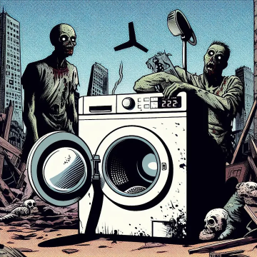

# TB Basic Needs

## Description

## Features
- Player has to make poo and pee, if he did not and you have configured, player will loos blood and health
- Pee and Poo will make body and clothing dirty
- Player can clean his body and clothing
- Player can digg in and out poo and pee
- new Item added "TB_Soap"
- Soap increase the cleaning effect for body
- different cleaning effects on different water sources
- player can clean clothing and body on all water sources
- clothes will be wet after cleaning
- player needs to dress up, to clean himself
- player can only clean clothes when he has it in his hands
- if player or clothes are max dirty, zombies and animals will smell him earlier
- if player is dirty, flies will be around him


## Shop Link
https://lbmaster.de/product.php?id=25

## Support

If you need any support, please open a ticket here: https://discord.gg/kGjN6gJy3m

## Youtube

[](https://youtu.be/3CVjtuJO8gE)
[](https://www.youtube.com/watch?v=Z5NNgfVLpaQ)

## FAQ

### How to install

- Take the Server PBO and bring it into your own server side pack
- Take the Client PBO and bring it into your own client pack. Publish this Pack on steam.
- Start your server. Some more configurations will be generated.
- Tear down the server
- Configure your needs
- Start your Server :-)

### How to migrate from Version 1.x.x to 2.x.x

**Please read before everything, before you start.**

1. Backup everything ``YourServerProfilesFolder\TBDailyReward`` files from Mod
1. Backup the old pbos from server and client and remove them from your server and client package
1. Download the new version and copy over, do not forget also the TBLib update.
1. Start the server
1. Wait server is up
1. Stop the server
1. Copy everything from `YourServerProfilesFolder\TBBasicNeeds\Config` into `YourServerProfilesFolder\TBMods\Config\TBBasicNeeds`
1. Copy everything from `YourServerProfilesFolder\TBBasicNeeds\Data` into `YourServerProfilesFolder\TBMods\Data\TBBasicNeeds`
1. Update done. Start your Server
1. If everything is fine, you can delete the old folder ``YourServerProfilesFolder\TBBasicNeeds``

## Items included

- TB_Soap for cleaning body and clothing
- TB_PooGround
- TB_PeeGround
- TBDetergent for cleaning clothing in washing machine
- TBWashingMachine this can be picked up by players and placed in the world
- TBStaticWashingMachine this can not be picked up by players
- TBNCanisterGasoline for washing machine

```xml
<?xml version="1.0" encoding="UTF-8" standalone="yes"?>
<types>
    <type name="TBNCanisterGasoline">
        <nominal>15</nominal>
        <lifetime>7200</lifetime>
        <restock>14400</restock>
        <min>7</min>
        <quantmin>-1</quantmin>
        <quantmax>-1</quantmax>
        <cost>100</cost>
        <flags count_in_cargo="0" count_in_hoarder="0" count_in_map="1" count_in_player="0" crafted="0" deloot="0"/>
        <category name="tools"/>
        <usage name="Town"/>
        <usage name="Village"/>
    </type>
    <type name="TB_Soap">
        <nominal>15</nominal>
        <lifetime>7200</lifetime>
        <restock>14400</restock>
        <min>7</min>
        <quantmin>-1</quantmin>
        <quantmax>-1</quantmax>
        <cost>100</cost>
        <flags count_in_cargo="0" count_in_hoarder="0" count_in_map="1" count_in_player="0" crafted="0" deloot="0"/>
        <category name="tools"/>
        <usage name="Town"/>
        <usage name="Village"/>
    </type>
    <type name="TBDetergent">
        <nominal>15</nominal>
        <lifetime>7200</lifetime>
        <restock>14400</restock>
        <min>7</min>
        <quantmin>-1</quantmin>
        <quantmax>-1</quantmax>
        <cost>100</cost>
        <flags count_in_cargo="0" count_in_hoarder="0" count_in_map="1" count_in_player="0" crafted="0" deloot="0"/>
        <category name="tools"/>
        <usage name="Town"/>
        <usage name="Village"/>
    </type>
    <type name="TBWashingMachine">
        <nominal>8</nominal>
        <lifetime>432000</lifetime>
        <restock>14400</restock>
        <min>5</min>
        <quantmin>-1</quantmin>
        <quantmax>-1</quantmax>
        <cost>100</cost>
        <flags count_in_cargo="0" count_in_hoarder="0" count_in_map="1" count_in_player="0" crafted="0" deloot="0"/>
        <category name="tools"/>
        <usage name="Town"/>
        <usage name="Village"/>
    </type>
    <type name="TBStaticWashingMachine">
        <lifetime>3801600</lifetime>
        <flags count_in_cargo="0" count_in_hoarder="0" count_in_map="1" count_in_player="0" crafted="0" deloot="0"/>
    </type>
    <type name="TB_PooGround">
        <lifetime>14400</lifetime>
        <flags count_in_cargo="0" count_in_hoarder="0" count_in_map="1" count_in_player="0" crafted="0" deloot="0"/>
    </type>
    <type name="TB_PeeGround">
        <lifetime>14400</lifetime>
        <flags count_in_cargo="0" count_in_hoarder="0" count_in_map="1" count_in_player="0" crafted="0" deloot="0"/>
    </type>
</types>

```

## Configurations

### AdminConfig.json

Admins can currently reload the config for the static washing places.

see [AdminConfig.json](../GlobalConfigs/Readme.md#adminconfigjson)

### Config.json

````
{
    "version": "4", // Never touch this value. It is needed internally
    "animationCommandUID": 1056, // see https://github.com/BohemiaInteractive/DayZ-Script-Diff/blob/main/scripts/3_game/dayzplayer.c#L1007 !!!!DO NOT CHANGE IF YOU NOT KNOW WHAT YOU DO!!! This change the animation for poo and pee
    "stanceMask": 2, // see https://github.com/BohemiaInteractive/DayZ-Script-Diff/blob/main/scripts/3_game/dayzplayer.c#L634 !!!!DO NOT CHANGE IF YOU NOT KNOW WHAT YOU DO !!! This change the stance for poo and pee
    "cleanItemsWhenPoo": [ // This clean items are needed when you make poo
        {
            "type": "Paper", // Item type
            "dirtFactorForBodyInPercent": 5.0 // How much dirt will be add to body
        },
        {
            "type": "BandageDressing", // Item type
            "dirtFactorForBodyInPercent": 1.0  // How much dirt will be add to body
        },
        {
            "type": "Rag", // Item type
            "dirtFactorForBodyInPercent": 2.5  // How much dirt will be add to body
        }
    ],
    "cleanItemsForBodyWash": [ //this items can be used if you want to clean your body
        {
            "type": "NoItemInHands", // this is a static value. You can use is to make it possible to wash the body without any item in hands
            "dirtDecreaseFactorForBodyInPercentForWell": 50.0, // How much dirt will be decreased for body when you are on a well
            "dirtDecreaseFactorForBodyInPercentForFreshWater": 25.0, // How much dirt will be decreased for body when you are in a fresh water source
            "dirtDecreaseFactorForBodyInPercentForSeeWater": 12.5, // How much dirt will be decreased for body when you are in a see water source
            "dirtDecreaseFactorForBodyInPercentForDirtWater": 6.0 // How much dirt will be decreased for body when you are in a dirty water source
        },
        {
            "type": "TB_Soap", // Item type
            "dirtDecreaseFactorForBodyInPercentForWell": 100.0, // How much dirt will be decreased for body when you are on a well
            "dirtDecreaseFactorForBodyInPercentForFreshWater": 50.0, // How much dirt will be decreased for body when you are in a fresh water source
            "dirtDecreaseFactorForBodyInPercentForSeeWater": 25.0, // How much dirt will be decreased for body when you are in a see water source
            "dirtDecreaseFactorForBodyInPercentForDirtWater": 15.0 // How much dirt will be decreased for body when you are in a dirty water source
        }
    ],
    "cleanItemsForClothingWash": [ //this items can be used if you want to clean your clothing, the items must be in the clothing itself to get the effect. 
        {
            "type": "NoCleanItemInClothing", // this is a static value. You can use is to make it possible to wash the clothing without any item in clothing
            "dirtDecreaseFactorForBodyInPercentForWell": 50.0, // How much dirt will be decreased for clothing when you wash they are on a well
            "dirtDecreaseFactorForBodyInPercentForFreshWater": 25.0, // How much dirt will be decreased for clothing when you wash they are in a fresh water source
            "dirtDecreaseFactorForBodyInPercentForSeeWater": 12.5, // How much dirt will be decreased for clothing when you wash they are in a see water source
            "dirtDecreaseFactorForBodyInPercentForDirtWater": 6.0 // How much dirt will be decreased for clothing when you wash they are in a dirty water source
        },
        {
            "type": "TB_Soap", // Item type
            "dirtDecreaseFactorForBodyInPercentForWell": 100.0, // How much dirt will be decreased for clothing when you wash they are on a well
            "dirtDecreaseFactorForBodyInPercentForFreshWater": 50.0, // How much dirt will be decreased for clothing when you wash they are in a fresh water source
            "dirtDecreaseFactorForBodyInPercentForSeeWater": 25.0, // How much dirt will be decreased for clothing when you wash they are in a see water source
            "dirtDecreaseFactorForBodyInPercentForDirtWater": 12.5 // How much dirt will be decreased for clothing when you wash they are in a dirty water source
        }
    ],
    "pooIncreaseFactorPerTick": 1.0, // How much poo will be increased per tick
    "pooHealthReduceStatePerTickInPercent": 0.01, // How much health will be reduced per tick for poo. 1.0 means 100% health loos
    "pooBloodReduceStatePerTickInPercent": 0.01, // How much blood will be reduced per tick for poo. 1.0 means 100% blood loos
    "peeIncreaseFactorPerTick": 1.0, // How much pee will be increased per tick 
    "peeHealthReduceStatePerTickInPercent": 0.01, // How much health will be reduced per tick for pee. 1.0 means 100% health loos
    "peeBloodReduceStatePerTickInPercent": 0.01, // How much blood will be reduced per tick for pee. 1.0 means 100% blood loos
    "tickLengthInMinutes": 5 // How long is a tick in minutes
}
````

### BodyZoneConfig.json

````
{
    "version": "1", // Never touch this value. It is needed internally
    "regular": { // This part is for clothing or body when one "tick" is over from Config.json
        "DirtIncreaseForHeadClothing": 1.0, // How much dirt will be increased for head clothing
        "DirtIncreaseForHeadgearClothing": 1.0, // How much dirt will be increased for headgear clothing
        "DirtIncreaseForMaskClothing": 1.0, // How much dirt will be increased for mask clothing
        "DirtIncreaseForGlovesClothing": 1.0, // How much dirt will be increased for gloves clothing
        "DirtIncreaseForArmbandClothing": 1.0, // How much dirt will be increased for armband clothing
        "DirtIncreaseForVestClothing": 1.0, // How much dirt will be increased for vest clothing
        "DirtIncreaseForBackClothing": 1.0, // How much dirt will be increased for back clothing
        "DirtIncreaseForHipsClothing": 1.0, // How much dirt will be increased for hips clothing
        "DirtIncreaseForLegsClothing": 1.0, // How much dirt will be increased for legs clothing
        "DirtIncreaseForFeetClothing": 1.0, // How much dirt will be increased for feet clothing
        "DirtIncreaseForBodyClothing": 1.0, // How much dirt will be increased for body clothing
        "DirtIncreaseForBody": 1 // How much dirt will be increased for body
    },
    "whenPee": { // This part is for clothing or body when player pees
        "DirtIncreaseForHeadClothing": 1.0, // How much dirt will be increased for head clothing
        "DirtIncreaseForHeadgearClothing": 1.0, // How much dirt will be increased for headgear clothing
        "DirtIncreaseForMaskClothing": 1.0, // How much dirt will be increased for mask clothing
        "DirtIncreaseForGlovesClothing": 1.0, // How much dirt will be increased for gloves clothing
        "DirtIncreaseForArmbandClothing": 1.0, // How much dirt will be increased for armband clothing
        "DirtIncreaseForVestClothing": 1.0, // How much dirt will be increased for vest clothing
        "DirtIncreaseForBackClothing": 1.0, // How much dirt will be increased for back clothing
        "DirtIncreaseForHipsClothing": 1.0, // How much dirt will be increased for hips clothing
        "DirtIncreaseForLegsClothing": 1.0, // How much dirt will be increased for legs clothing
        "DirtIncreaseForFeetClothing": 1.0, // How much dirt will be increased for feet clothing
        "DirtIncreaseForBodyClothing": 1.0, // How much dirt will be increased for body clothing
        "DirtIncreaseForBody": 1.0 // How much dirt will be increased for body
    },
    "whenPoo": { // This part is for clothing or body when player poos
        "DirtIncreaseForHeadClothing": 1.0, // How much dirt will be increased for head clothing
        "DirtIncreaseForHeadgearClothing": 1.0, // How much dirt will be increased for headgear clothing
        "DirtIncreaseForMaskClothing": 1.0, // How much dirt will be increased for mask clothing
        "DirtIncreaseForGlovesClothing": 1.0, // How much dirt will be increased for gloves clothing
        "DirtIncreaseForArmbandClothing": 1.0, // How much dirt will be increased for armband clothing
        "DirtIncreaseForVestClothing": 1.0, // How much dirt will be increased for vest clothing
        "DirtIncreaseForBackClothing": 1.0, // How much dirt will be increased for back clothing
        "DirtIncreaseForHipsClothing": 1.0, // How much dirt will be increased for hips clothing 
        "DirtIncreaseForLegsClothing": 1.0, // How much dirt will be increased for legs clothing
        "DirtIncreaseForFeetClothing": 1.0, // How much dirt will be increased for feet clothing
        "DirtIncreaseForBodyClothing": 1.0 // How much dirt will be increased for body clothing
    }
}
````

### StaticWashingPlaces.json

````
{
    "version": "1", // Never touch this value. It is needed internally
    "isInitialized": 1, // Never touch this value. It is needed internally
    "washingPlaces": [
        {
            "position": [ // Position of the washing place
                5710.37109375, // X
                62.355655670166019, // Y
                2446.04736328125 // Z
            ],
            "orientation": [ // Orientation of the washing place
                -178.8500213623047, 
                0.0,
                -0.0
            ],
            "needsDetergent": 1, // 1 = needs detergent, 0 = no detergent needed
            "needsWater": 1, // 1 = needs water, 0 = no water needed
            "needsEnergy": 1, // 1 = needs energy, 0 = no energy needed
            "useExactPosition": 1 // 1 = use exact position, 0 = use position with some tolerance
        },
        {
            "position": [ 
                5707.7783203125,
                62.35565948486328,
                2445.828369140625
            ],
            "orientation": [
                -178.8500213623047,
                0.0,
                -0.0
            ],
            "needsDetergent": 1,
            "needsWater": 1,
            "needsEnergy": 1,
            "useExactPosition": 1
        }
    ]
}

````

### WashingMachineConfig.json

````
{
    "version": "1", // Never touch this value. It is needed internally
    "energyQuantityConsumptionPerMinuted": 10.0, // How much energy will be consumed per minute per clothing
    "waterQuantityConsumptionPerMinuted": 100.0, // How much water will be consumed per minute per clothing
    "detergentQuantityConsumptionPerMinuted": 1.0, // How much detergent will be consumed per minute per clothing
    "cleanEffectivenessPerMinuted": 34.0, // How much dirt will be decreased per minute per clothing
    "itemsThatGetDamageWhenInWashedClothing": [ // Items can be get damaged when they are in inventory of closthing
        {
            "type": "IsElectricAppliance", // All Items that are electric becomes damage
            "damagePerMinute": 10 // How much damage will be done per minute
        },
        {
            "type": "Paper", // Item type
            "damagePerMinute": 10 // How much damage will be done per minute
        }
    ]
}
````