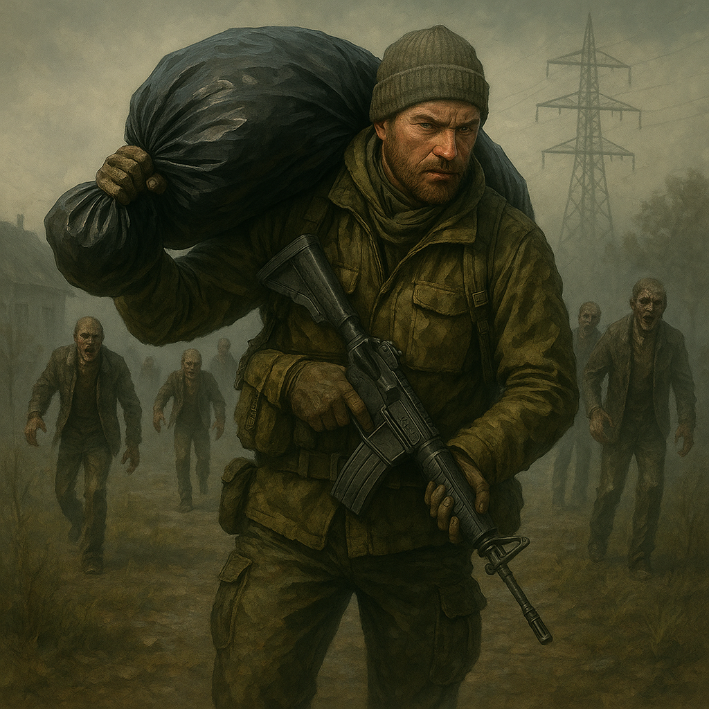
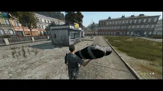
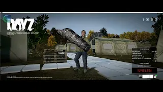

# TB Carry

A Mod to carry dead players.

## Shop Link
https://www.themodbase.com/mods/TBCarry

## Support

If you need any support, please open a ticket here: https://discord.gg/kGjN6gJy3m

## Youtube

## Features

- you can carry dead players
- if a dead body de-spawn by DayZ Lifetime, the player who carry will get the items when he drops the dead body
- Body bags can be placed into vehicle
- Body bag can show who is in that bag and when it was packed
- All gears of players will be saved in the body bag, if dead body de-spawn by DayZ Lifetime 
- zero config

## How to install

See also [here](../The%20Mod%20Base/README.md)

- Take the Server PBO and bring it into your own server side pack
- Take the Client PBO and the TBLib PBO and bring it into your own client pack. Publish this Pack on steam.
- Start your Server :-) 

## Configuration

No configuration needed.

### Item Class name
- TBCPlayerBaseBodyBack