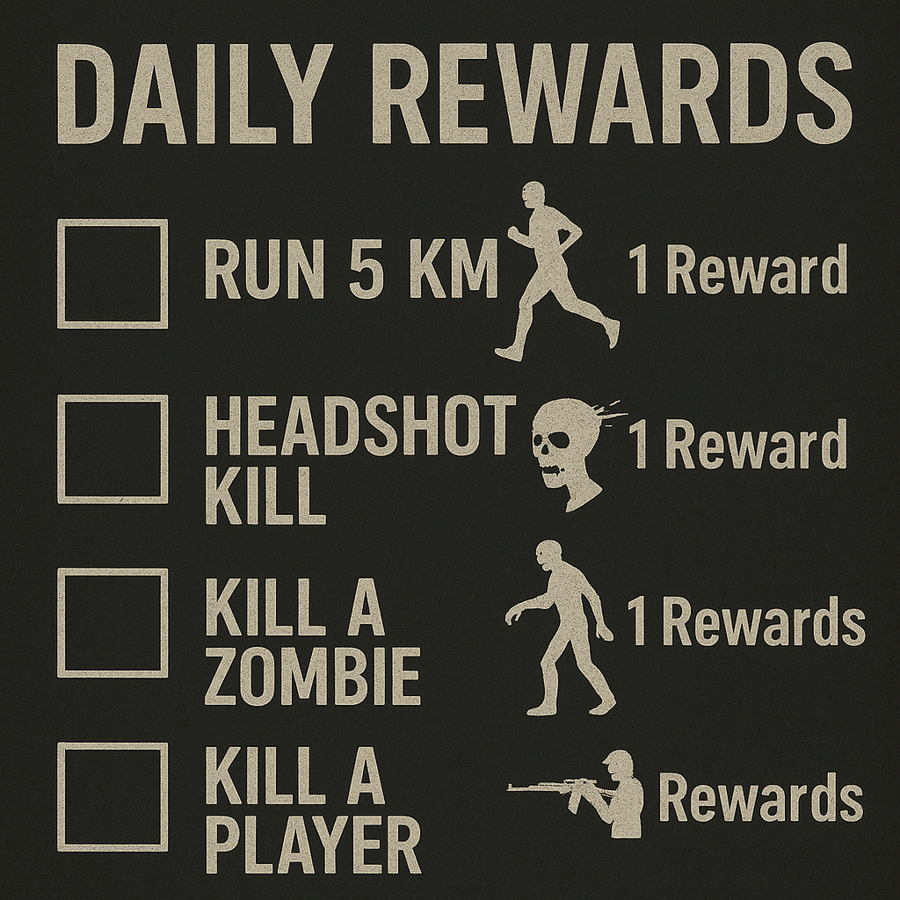

# TB Daily Reward

## Description
This Mod allows you in DayZ to get a reward for everyday you play on the server.

## Shop Link
https://www.themodbase.com/mods/TBDailyReward

## Support

If you need any support, please open a ticket here: https://discord.gg/kGjN6gJy3m

## Youtube

## Features
- monetise your sever with premium rewards
- (non-) premium rewards for players
- reward levels can have multiple rewards collections (the player will get one of the collections as one reward)
- rewards collections can have multiple items
- Logging on discord and/or csv file
- Configurations:
  - reward levels
  - reward level names that will shown in UI
  - reward items
  - reward conditions
    - player kills
    - headshot kills (will not count as player kill)
    - infected kills
    - walked distance
    - time played
    - animal type kills
  - reward collections
  - rewards can be limited for server, so for example a reward can be taken only 10 times by all players 
- Player gets an in game notification when he is abele to take a reward  
- Over 1400 Items pre-configured, you can just use it
- Toggle Animation when player starts to get reward
- Win animation when player gets reward
- 3 Included Premium Coins to give player premium status for 1, 7 or 30 days 
- Admins can 
  - in game reload configs and player data
  - can reset all player data in game
  

## FAQ
[FAQ.md](FAQ.md)

## Configurations

See also the [config editor](https://doc.themodbase.com/DailyRewardConfigEditor/TheBusterConfigEditor.zip)

- [AdminConfig.json](../GlobalConfigs/Readme.md#adminconfigjson)
- [TBKeyBindsConfig.json](../GlobalConfigs/Readme.md#tbkeybindsconfigjson)
- [General.json](./Configs/General.md)
- [RewardLevels.md](./Configs/RewardLevels.md)
- [Items/Example_Item_1.md](./Configs/Example_Item_1.md)
- [RewardLevels/Level_1_Example_Reward_1.md](./Configs/Level_1_Example_Reward_1.md)
- [LevelConditions/Example_Level_Condition_1.md](./Configs/Example_Level_Condition_1.md)
- [Logger.md](./Configs/Logger.md)

