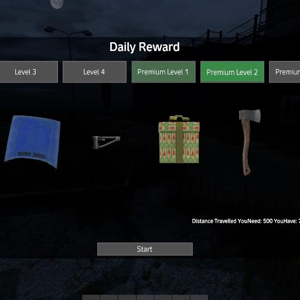
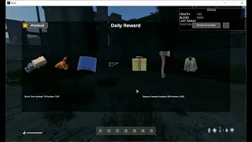

# TB Daily Reward



## Description
This Mod allows you in DayZ to get a reward for every day you play on the server.

## Shop Link
https://lbmaster.de/product.php?id=20

## Support

If you need any support, please open a ticket here: https://discord.gg/kGjN6gJy3m

## Youtube

[](https://youtu.be/ulrSrztYB1c)

## Features
- monetise your sever with premium rewards
- also non premium rewards possible
- You can configure your reward levels
- You can configure your reward items
- reward levels can have multiple rewards collections (the player will get one of the collections as one reward)
- rewards collections can have multiple items
- You can set period of days for the reward
- Reward Conditions:
  -- Player Kills
  -- Infected Kills
  -- Walked Distance
  -- Time Played
- Over 1400 Items pre configured, you can just use it
- Toggle Animation when player starts to get reward
- Win animation when player gets reward
- Logging in files or Discord Webhook
- Admins can make a hot reload of configs an player data

## FAQ

### How to install

- Take the Server PBO and bring it into your own server side pack
- Take the Client PBO and bring it into your own client pack. Publish this Pack on steam.
- extract TBDailyReward.zip
- Copy the extracted Folder `TBDailyReward` into your server profile folder.
- Start your server. Some more configurations will be generated.
- Tear down the server
- Configure your needs
- Start your Server :-)

### How to migrate from Version 1.x.x to 2.x.x

**Please read before everything, before you start.**

1. Backup everything ``YourServerProfilesFolder\TBDailyReward`` files from Mod
1. Do not move the original files and folders form ``YourServerProfilesFolder\TBDailyReward`` some files will be migrated to new locations
1. Delete the old pbos from server and client
1. Download the new version and copy over
1. Start the server
1. Wait server is up
1. `PremiumUser.json` and `AdminConfig.json` will now migrate to new versions. You will find them now in `YourServerProfilesFolder\TBMods\Data\Global` and `YourServerProfilesFolder\TBMods\Config\Global`
1. Stop the server
1. Copy everything except `PremiumUser.json`, `TBKeyBindsConfig.json` and `AdminConfig.json` from `YourServerProfilesFolder\TBDailyReward\Config` into `YourServerProfilesFolder\TBMods\Config\TBDailyReward`
1. Copy everything from `YourServerProfilesFolder\TBDailyReward\Data` into `YourServerProfilesFolder\TBMods\Data\TBDailyReward`
1. Configure the [tbKeyBindsConfig.json](../GlobalConfigs/Readme.md#tbkeybindsconfigjson) for your needs
1. Update done. Start your Server


### How i can give player premium status?

There are 3 Items implemented. Just give him one of the items and he will get premium status for Daily Reward.

- TBDRPremiumCoinGold | 30 Days Premium in Daily Reward
- TBDRPremiumCoinSilver | 7 Days Premium in Daily Reward
- TBDRPremiumCoinBronze | 1 Day Premium in Daily Reward

## Configurations

### Logger.json
````
{
    "version": "1",  // Never touch this value. It is needed internally
    "logReward": 1, // 0 = no logging, 1 = logging in files
    "logRewardDiscord": 1, // 0 = no logging, 1 = logging in discord
    "discordRewardWebhookURL": "your dicord webhook url", // if you want to log in discord, you need to set this value
}
````

### TBKeyBindsConfig.json

see [TBKeyBindsConfig.json](../GlobalConfigs/Readme.md#tbkeybindsconfigjson)


### AdminConfig.json

Admins can currently make a hot reload of configs and player data. Only they see the button in the menu.

see [AdminConfig.json](../GlobalConfigs/Readme.md#adminconfigjson)


### Items/Example_Item_1.json

Here you can configure your items.

````
{
	"uniqueName": "Example_Item_1", // This name must match with the file name except the .json. For example if you file name is Example_Item_1.json, this value must be Example_Item_1
	"health": 100.0, // The health of the item in percent 100 means 100%
	"type": "AK74_Complete", // the type name from types.xml
	"quantity": 1.0, // The quantity of the item in percent 1.0 means 100%, 0.5 means 50%
	"attachmentUniqueNames": [ // Here you can add and name your own previuse created items as attachments. They must be in the same folder as this item
	    "AK74_WoodBttstck",
		"AK74_Hndgrd",
		"PSO11Optic",
		"Mag_AK74_30Rnd"
	],
	"isCar": 0 // if this item is a car, set this value to 1 if not to 0
}
````

### RewardLevels/Level_1_Example_Reward_1.json
````
{
	"uniqueName": "Level_1_Example_Reward_1", // This name must match with the file name except the .json. For example if your file name is Level_1_Example_Reward_1.json, this value must be Level_1_Example_Reward_1
	"isLoaded": 0, // Never touch this value. It is needed internally
	"version": "1", // Never touch this value. It is needed internally
	"level": 1, // The level of the reward
	"canTakenTimes": -1, // How many times all players can take this reward, -1 means unlimited times, 10 means 10 times for all players, if you want to reset the taken times, just delete in ServerProfile\TBDailyReward\Data\Level_1_Example_Reward_1.json and reload all configs
	"uniqueItemNames": [  // Here you can add and name your own previuse created reward items. for configuration see Items/Example_Item_1.json
		"Example_Item_1",
		"GiftBox_Medium_2",
		"Engraved1911_Complete",
		"CombatBoots_Black"
	]
}
````

### LevelConditions/Example_Level_Condition_1.json

You have to create for every level one level condition, You can name it as you want. If you want to use the condition you have to add the name in the RewardLevels.json (see below)

````
{
    "uniqueName": "Example_Level_Condition_1", // This name must match with the file name except the .json. For example if you file name is Example_Level_Condition_1.json, this value must be Example_Level_Condition_1
    "isLoaded": 0,  // Never touch this value. It is needed internally
    "level": 1, // The level of the condition
    "onlineTimeRequiredInMinutes": 10, // The time the player must be online to get the reward or -1 to disable this condition
    "playerKillsRequiredCount": -1, // The player kills the player must have to get the reward or -1 to disable this condition
    "infectedKillsRequiredCount": -1, // The infected kills the player must have to get the reward or -1 to disable this condition
    "distanceTravelledRequiredInMeters": 300, // The distance the player must have to get the reward or -1 to disable this condition
    "canReTakenAfterPeriodOfDaysRealTime": 1, // The real time in days that player must wait to get the reward again or -1 to disable this condition
    "animalKills": { // The animal kills the player must have to get the reward leave it empty to disable this condition
        "Animal_GallusGallusDomesticus": 1 // "Animal Type Name": count of required kills, 
    },
    "version": "1" // Never touch this value. It is needed internally
}
````


#### Vanilla Animal Types

If an animal is not listed here, you can just kill one and then take a look into mod data folder. In player data is then created an entry  with the type of the animal.

````

Animal_GallusGallusDomesticus
Animal_GallusGallusDomesticusF_Brown
Animal_GallusGallusDomesticusF_Spotted
Animal_GallusGallusDomesticusF_White

Animal_UrsusArctos

Animal_BosTaurusF_Brown
Animal_BosTaurusF_Spotted
Animal_BosTaurusF_White
Animal_BosTaurus_Brown
Animal_BosTaurus_Spotted
Animal_BosTaurus_White

Animal_CervusElaphus
Animal_CervusElaphusF

Animal_CapraHircusF
Animal_CapraHircus_Black
Animal_CapraHircus_Brown
Animal_CapraHircus_White

Animal_SusDomesticus

Animal_CapreolusCapreolus
Animal_CapreolusCapreolusF

Animal_OvisAries
Animal_OvisAriesF

Animal_SusScrofa

Animal_CanisLupus_Grey
Animal_CanisLupus_White

````


### RewardLevels.json

This is a collection of your reward levels and level conditions

````
{
    "defaultLevelConditionUniqueNames": [ // Here you can add and name your own previuse created level conditions. for configuration see LevelConditions/Example_Level_Condition_1.json
        "Example_Level_Condition_1", // This name must match with the name of the file except the .json. For example if you file name is Default_Level_Condition_1.json, this value must be Default_Level_Condition_1 
        "Default_Level_Condition_2",
        "Default_Level_Condition_3",
        "Default_Level_Condition_4"
    ],
    "premiumLevelConditionUniqueNames": [ // Here you can add and name your own previuse created level conditions. for configuration see LevelConditions/Level_1_Example_Reward_1.json
        "Premium_Level_Condition_1", // This name must match with the name of the file except the .json. For example if you file name is Premium_Level_Condition_1.json, this value must be Premium_Level_Condition_1
        "Premium_Level_Condition_2",
        "Premium_Level_Condition_3",
        "Premium_Level_Condition_4"
    ],
    "uniqueNameRewardLevels": [ // Here you can add and name your own previuse created reward levels. for configuration see RewardLevels/Level_1_Example_Reward_1.json
        "Level_1_Example_Reward_1", // This name must match with the name of the file except the .json. For example if you file name is Level_1_Example_Reward_1.json, this value must be Level_1_Example_Reward_1
        "Level_1_Reward_2",
        "Level_2_Reward_1",
        "Level_2_Reward_2",
        "Level_3_Reward_1",
        "Level_3_Reward_2",
        "Level_4_Reward_1",
        "Level_4_Reward_2"
    ],
    "uniqueNamePremiumRewardLevels": [ // Here you can add and name your own previuse created reward levels. for configuration see RewardLevels/Level_1_Example_Reward_1.json
        "Level_1_Premium_Reward_1", // This name must match with the name of the file except the .json. For example if you file name is Level_1_Premium_Reward_1.json, this value must be Level_1_Premium_Reward_1
        "Level_2_Premium_Reward_1",
        "Level_3_Premium_Reward_1",
        "Level_3_Premium_Reward_2",
        "Level_4_Premium_Reward_1",
        "Level_4_Premium_Reward_2"
    ]
}

````
