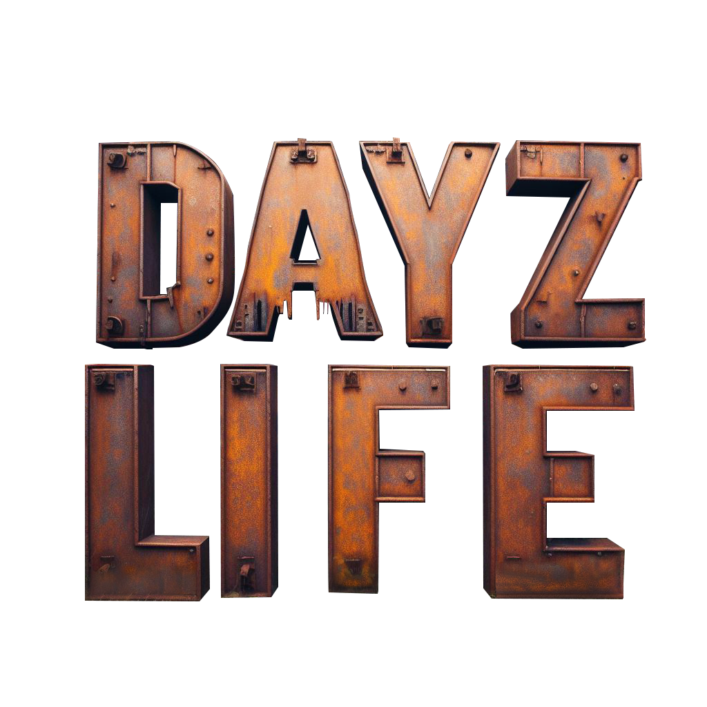

# DayZ Life Version 2 (RP Framework)

***Version 1 see: https://dayz-life.net/***

## Index

- [**`SettingUpAServer`**](./SettingUpAServer.md)
- [**`Configs`**](./Configs/Readme.md)
- [**`Types`**](./Types.md)
- [**`Keybindings`**](./Keybindings.md)

## Workshop Links:

- [**`DayZ Life`**](https://steamcommunity.com/sharedfiles/filedetails/?id=3196291732)
- [**`DayZ Life - Server`**](https://steamcommunity.com/sharedfiles/filedetails/?id=3196294051)

## Extensions

- [**`TB Revive Mod`**](https://www.themodbase.com/mods/TBRevivePlayer) 
- [**`TB Real Estate Mod`**](https://www.themodbase.com/mods/TBRealEstate) Buy and extend houses.

## Feature List

### General Features

    - Supported languages: All
    - Spawn Menu with Job choice
    - Job change is possible every time without dying  (CTRLL + 3)
    - own Money-System ( but you can still use other currencies)
    - tax system, A tax is due for each sale at the trader.
    - money can be stolen from other and dead players

### Messenger System (CTRLL + 4)

    - players have a contact book
    - can exchange contact data via F action
    - can replay to messages
    - Medics can see where emergency comes from
    - send anonymous messages
    - cops can send messages to all players
    - must have a personal radio with active battery to use message system (configurable)

### Vehicles

    - Key System
    - last driver can sell vehicles
    - every vehicle has one owner
    - every player, who has access to vehicles, can see the owner of the vehicles
    - configurable no vehicles collision damage
    - can be parked in a virtual garage
    - can be raided
    - insurance for vehicles damage, can be taken at garage
    - can be tuned (replace vehicles/parts) by a tuning menu for restricted job

### Banking System

    - pay in / pay out
    - transfer money over bank
    - transfer money directly to players
    - time and player count controlled raids
    - bank can be raided
    - Bank rob steal the configured percentage from tax income, so player dont lose any money at bank rob.
    - if a player dies, the money will stay at the dead character. The money at bank will not be touched

### Trader System

    - several trader locations
    - trader can be configured, so that they can only used by a job group job groubs or by all
    - dynamic prices for items related to trader storage

### Shop Robbery 
    - players can rob the shop
    - Cops get a starting notifiocation
    - Cops can get a message where (Map in message menu) the shop is raided and who is the raider

### legal and illegal harvest of resources.

      - coal
      - iron
      - copper
      - cocaine
      - stones
      - apple
      - you can define own harvestable resources
      - (some) resources can be further processed into goods.

### License-System

      - Players require a license to harvest certain resources (can be changed)
      - Players require a license for the further processing of resources (can be changed)

### Job System

    - you can define your own jobs
    - Players can choose a job at spawn, if they have the right to do so
    - Players can change their job at any time
    - Jobs can be configured with different ranks
    - Jobs can be configured with different salaries
    - Jobs can be configured with different spawn equipment
    - Jobs can be configured with different spawn positions
    - Jobs can be configured with different loadouts
    - Jobs can be configured with own buildings where no other job has access, except it will be rauided by a tool

### implemented Almanac to figure out what you need/what you can do and how, short key to open is RCTRL and LCTRL or LCTRL and 1

    - display online players per role in Almanac
    - Admins can (There are Panels in Almanac)
    - in game delete/reset player data related to our mod
    - can give players the role of differend jobs
    - player that can manage cops can also access all doors and house inventories"
    - can give players money to player or bank
    - can see details of players in game
    - many logs to make the admin life easy

### Arrest System

    - Prisoners must stay in range of a specific point (can be manually set in the config), to reduce his arrest time
    - Player can get a paycheck, role related configurable

### Cops

    - can see owner of cars
    - can give player arrest
    - can open every car
    - can give player ticket
    - can see open tickets
    - can pay back the money from a bank robbery, every policeman who is online at that time gets a percentage

### Medics

    - have a panel in almanac where they can see player emergency

#### If TB Revive Mod (https://www.themodbase.com/mods/TBRevivePlayer) is installed

    - before a player dies, he got a menu to decide for heal by medic, heal by hospital or die.
    - Medics can heal other players
    - get money when they heal a player
    - get a message, when there is a new emergency

### Army

    - can give player arrest

### Fraction System (CTRLL + 6)

    - Players can create a fraction currently there are following access rights managed by fraction:
        - access to fraction garage
        - access to fraction bank account (pay in and amount is visible)
        - can take money from fraction bank account
