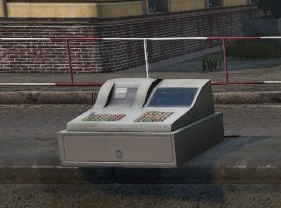
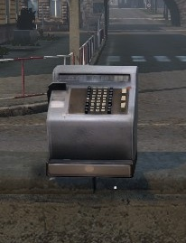
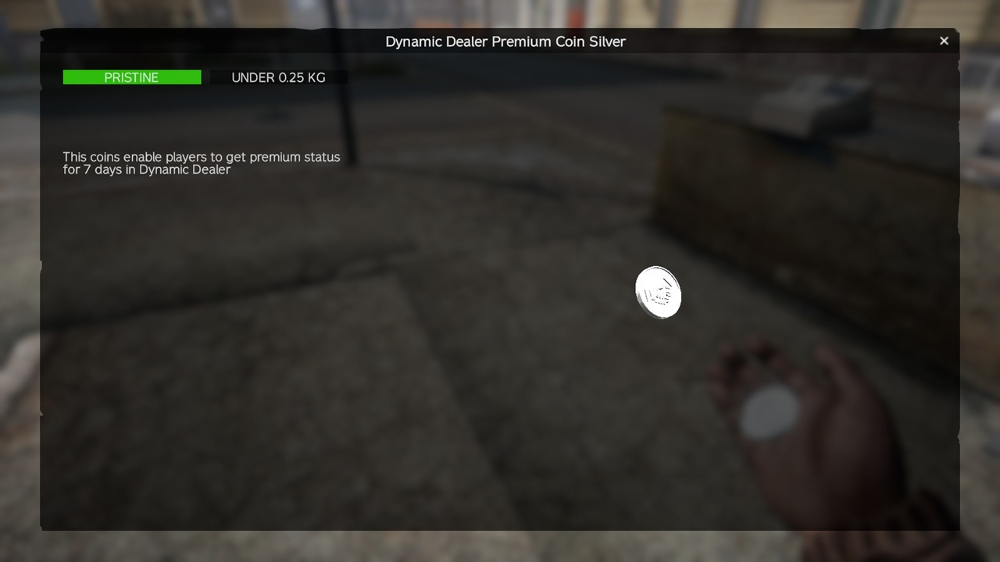
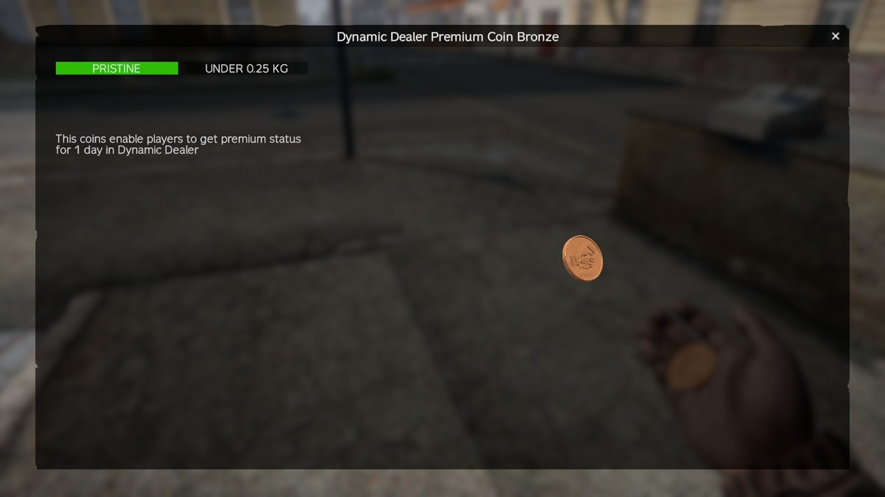

# Types

## What kind of Action Objects are available?
- TBDTCashier (used as Trader Object)
- TBDTCashierKit (used to create or move an Trader Position)
- TBDTPokladna (used as Trader Object)
- TBDTPokladnaKit (used to create or move an Trader Position)
- TBDTTraderMachine (used as Trader Object)
- TBDTTraderMachineKit (used to create or move an Trader Position)

## Premium Coins
- TBDynamicDealerPremiumCoinGold (used to give Player 30 Days of Premium)
- TBDynamicDealerPremiumCoinSilver (used to give Player 7 Days of Premium)
- TBDynamicDealerPremiumCoinBronze (used to give Player 1 Day of Premium)

## Images of Objects

(TBDTCashierKit or TBDTCashier)

(TBDTPokladnaKit or TBDTPokladna)

(TBDTTraderMachineKit or TBDTTraderMachine)

(TBDynamicDealerPremiumCoinGold)

(TBDynamicDealerPremiumCoinSilver)

(TBDynamicDealerPremiumCoinBronze)