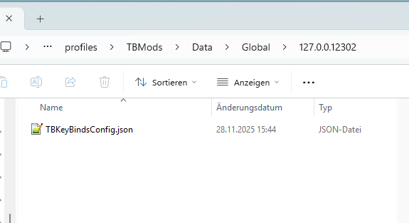

# TBKeyBindsConfig.json

::: tip
The key configs will also store on client side. So if a client join to your server and your config is `useServerKeyBind=0`
the key will not be overwritten if you set sometimes a new key. This can only be done by set `useServerKeyBind=1` or the client deletes the config file.


:::

````json lines
{
  "version": "1", // never change this, internal version number
  "keyBinds": [
    {
      "name": "UAInputOpenTBDailyReward",
      "defaultKey": 25, // default key is P, if you want to have another key, you can change it here. You can find the numbers in TBKeyCodeMatch.json
      "useServerKeyBind": 0 // if you enable this. All players will be forced to use your keybind and will have configured defaultKey
    },
    {
      "name": "UAInputOpenTBWarParty",
      "defaultKey": 48,
      "useServerKeyBind": 0
    },
    {
      "name": "UAInputOpenTBJOFBook",
      "defaultKey": 24,
      "useServerKeyBind": 0
    }
  ]
}
````