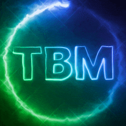

# Welcome to TB Mods (DayZ) Readme Pages

## Links:
- **Discord**: [Join our Discord](https://discord.gg/kGjN6gJy3m)
- **Shop**: [Visit our shop](https://themodbase.com/) 

## Index

Welcome to The Buster Mods documentation! Here you'll find comprehensive guides and configuration information for all our DayZ mods.

### 🎮 Core Mods

#### [BasicNeeds](BasicNeeds/Readme.md)
Advanced survival mechanics including body zones, diseases, washing machines, and dryers.
- **Features**: Body zone management, disease system, washing/drying mechanics
- **Configs**: Body zones, diseases, washing machines, dryers

#### [Carry](Carry/Readme.md)
Enhanced carrying system for DayZ with improved item management.
- **Features**: Advanced carrying mechanics, item organization

#### [DailyReward](DailyReward/Readme.md)
Daily reward system to keep players engaged with progressive rewards.
- **Features**: Daily rewards, level-based progression, item rewards
- **Configs**: Reward levels, item configurations, level conditions

#### [RealEstate](RealEstate/Readme.md)
Complete real estate system for property ownership and management.
- **Features**: House ownership, property management, raid protection
- **Configs**: House definitions, spawn points, raid configurations

#### [TBCarDealer](TBCarDealer/Readme.md)
Advanced car dealership system with configurable vehicles and pricing.
- **Features**: Vehicle dealerships, car customization, pricing system
- **Configs**: Car configurations, dealer points, price items
- **Tools**: Config editor available

### ⚔️ Combat & Events

#### [TBWarParty](TBWarParty/Readme.md)
PvP arena system with customizable gear sets and battle configurations.
- **Features**: Arena battles, gear sets, team management
- **Configs**: Arena configurations, gear sets, battle settings

#### [TBZombieEvents](TBZombieEvents/Readme.md)
Dynamic zombie events to enhance server gameplay.
- **Features**: Random zombie events, server-wide challenges

#### [RevivePlayer](RevivePlayer/Readme.md)
Player revival system for enhanced survival gameplay.
- **Features**: Player revival mechanics, medical system
- **Configs**: Revival settings, medical configurations

### 💰 Economy & Trading

#### [DayZLife](DayZLife/Readme.md)
Complete roleplay economy system with jobs, banking, and legal systems.
- **Features**: Job system, banking, legal system, car tuning, housing
- **Configs**: Job configurations, banking settings, legal system

#### [TBSecondHandMarket](TBSecondHandMarket/Readme.md)
Player-to-player trading marketplace system.
- **Features**: Item trading, market listings, player economy

#### [TBItemExchange](TBItemExchange/README.md)
Item exchange system for server economies.
- **Features**: Item conversion, economic balance

#### [DayZCasinoV2](DayZCasinoV2/Readme.md)
Casino system for server entertainment and economy.
- **Features**: Gambling mechanics, casino games
- **Configs**: Casino configurations, game settings

### 💎 Crafting & Items

#### [TBJewelsOfSurvival](TBJewelsOfSurvival/Readme.md)
Jewelry crafting system with magical rings and survival enhancements.
- **Features**: Ring crafting, magical effects, mining system
- **Configs**: Ring configurations, mining areas, crafting recipes
- **Rings**: Attack, Defense, Dragon Blood, Eagle Eye, Life, Owl, Perseverance

#### [DeathInsurance](DeathInsurance/Readme.md)
Insurance system to protect players from death penalties.
- **Features**: Death protection, insurance points, claim system
- **Configs**: Insurance configurations, point systems

### ⚙️ Utilities

#### [GlobalConfigs](GlobalConfigs/Readme.md)
Global configuration system for server management.
- **Features**: Centralized configuration, server settings
- **Configs**: Global settings, server configurations

---

## 📋 Quick Start Guide

1. **Choose your mods** - Browse the categories above to find mods that fit your server
2. **Read the documentation** - Each mod has detailed setup and configuration guides
3. **Configure settings** - Use the provided config schemas and examples
4. **Test thoroughly** - Always test mods on a development server first

## 🔧 Configuration

Most mods include:
- **Config schemas** - JSON schemas for validation
- **Example configurations** - Ready-to-use config examples
- **FAQ sections** - Common questions and troubleshooting

## 📞 Support

- **Discord**: [Join our Discord](https://discord.gg/kGjN6gJy3m)
- **Shop**: [Visit our shop](https://www.themodbase.com/) 
- **Documentation**: Each mod folder contains detailed README files

---

