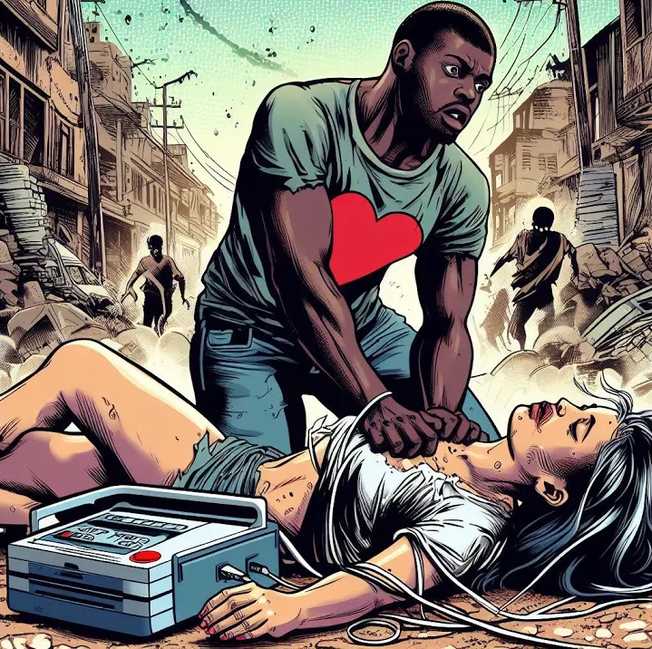
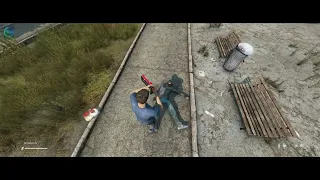

# TB Revive Player

A mod to revive dead players in DayZ.

## Shop Link
https://lbmaster.de/product.php?id=22

## Support

If you need any support, please open a ticket here: https://discord.gg/kGjN6gJy3m

## Youtube

## Features

- You can revive dead players by using the defibrillator
- defibrillator can be destroyed after usage
- Hospital (feature can be disabled)
  - Players can be revived in Hospitals (teleport)
  - Players have to pay for the revive (configurable)
  - support for LBMasters Advanced Banking, so player can pay via bank account, can be disabled via config
- Players don’t lose their inventory after revive
- revived players can get after reviving (configurable)
      - random cuts
      - blood level
      - shock
      - health

## How to install

- Take the Server PBO and bring it into your own server side pack
- Take the Client PBO and bring it into your own client pack. Publish this Pack on steam.
- Start your server. All configurations will now create in your Server profile folder.
- Tear down the server
- Remove the class name of the item "Defibrillator" from the `cfgIgnoreList.xml` in your mpmission folder
- Configure your needs
- Start your Server :-)

- [FAQ.md](FAQ.md)
- [HowToMigrateFrom1to2.md](HowToMigrateFrom1to2.md)

## Configuration
- [TBKeyBindsConfig.json](../GlobalConfigs/Readme.md#tbkeybindsconfigjson)
- [reviveConfig.md](Configs/reviveConfig.md)

