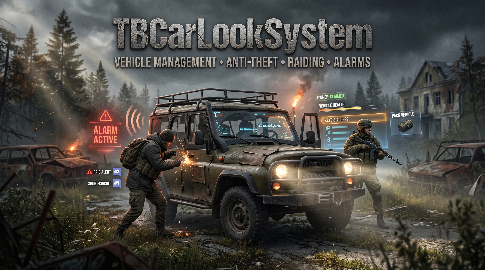
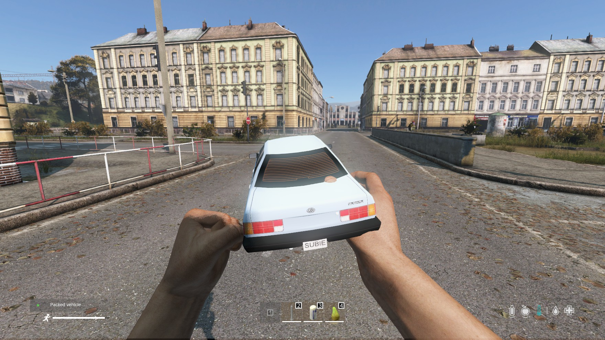
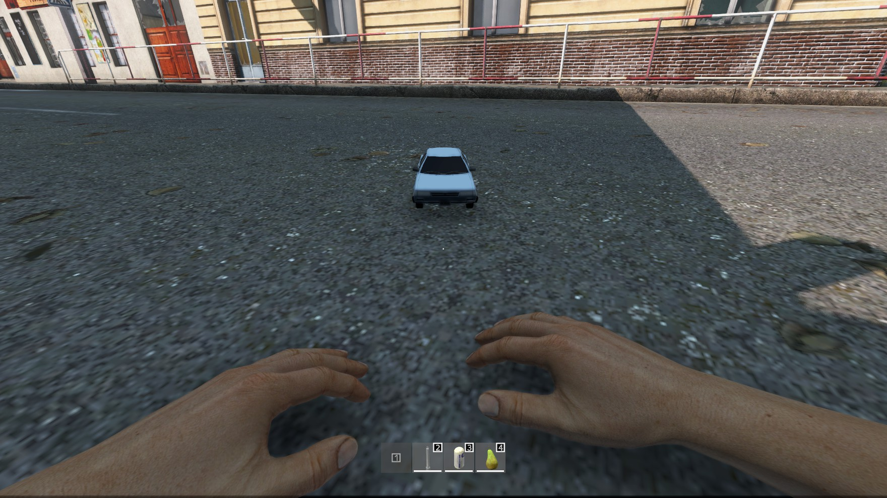

# TBCarLookSystem

TBCarLookSystem is a vehicle ownership, anti-theft, and vehicle-management mod. It lets players claim, lock, share, and upgrade vehicles, gives raiders ways to break in, and gives admins full oversight and audit logging.

## Features
- **Ownership & access** - claim a vehicle, transfer ownership, and manage key access for individual players or whole groups.
- **Raiding** - break into a locked vehicle with tools (e.g. Lockpick) or, without a tool, over a configurable time and chance.
- **Short circuiting** - disable a vehicle's engine/lock with tools (e.g. Screwdriver) or, without a tool, over a configurable time and chance; owners can repair it afterwards.
- **Alarms** - raiding or short-circuiting a vehicle triggers an alarm that raiders must turn off within a time limit.
- **Pack & unpack** - pack vehicles for storage or transport, with blacklisted areas where unpacking is not allowed.
- **Purchasable extensions** - Alarm System, Discord Raid Alert, Discord Short Circuit Alert, and Pack Vehicle, priced globally or per vehicle type.
- **Discord & in-game logging** - separate log channels for General, Raid Actions, Admin, and Key actions.
- **Admin oversight** - admins can remove ownership and audit key-access and ownership changes.

Full list of features can be found at [Shop](https://www.themodbase.com/mods/TBCarLookSystem)

## Shop Link
https://www.themodbase.com/mods/TBCarLookSystem

## Support

If you need any support, please open a ticket here: https://discord.gg/kGjN6gJy3m

## How to install

See also [here](../The%20Mod%20Base/README.md)

::: warning
Attention, please do a backup before you install the mod, it can destroy the vehicle data in your database. Wipe can be required.
:::

- Take the Server PBO and add it to your own server-side pack
- Take the Client PBO and the TBLib PBO and add them to your own client pack. Publish this pack on Steam.
- Start your server. All configurations will now be created in your server profile folder.
- Shut down the server
- Configure your needs
- Start your server :-)

## Configuration
- [AdminConfig.json](../GlobalConfigs/AdminConfig.md) Admins can currently reload configs and remove vehicle ownership.
- [CurrencyConfig.json](../GlobalConfigs/CurrencyConfig.md)
- [GeneralConfig.json](./Configs/GeneralConfig.md)
- [PackVehicleConfig.json](./Configs/PackVehicleConfig.md)
- [RaidVehicleConfig.json](./Configs/RaidVehicleConfig.md)
- [ShortCircuitVehicleConfig.json](./Configs/ShortCircuitVehicleConfig.md)
- [LoggerConfig.json](./Configs/LoggerConfig.md)

## Types
- TBCarLockPackedVehicle (for packed vehicle)

## FAQ

### How does raiding work?
If `needToolForRaid` is enabled, a raider needs one of the configured tools (e.g. Lockpick) to break in; each tool has its own success chance, time, tool damage, and optional vehicle-type restriction. If tools are not required, a raid instead succeeds after `carRaidTimeInSeconds` with a `chanceToRaid` percent chance. A successful raid or short circuit triggers the vehicle alarm, which the raider must turn off within `stopAlarmTimeInSeconds`.

### How does short circuiting work?
Short circuiting behaves the same way as raiding but disables the vehicle instead of granting access, and can be repaired by the owner afterwards using `repairShortCircuitTimeInSeconds`.

### Can I stop players from unpacking vehicles in certain areas?
Yes. Add the area to `unpackBlacklistAreas` in [PackVehicleConfig.json](./Configs/PackVehicleConfig.md) with a position and radius, and vehicles can't be unpacked there.

### Can I sell extensions like the Alarm System per vehicle type?
Yes. Each extension in [GeneralConfig.json](./Configs/GeneralConfig.md) has a default price/currency plus an optional per-vehicle-type price override.
