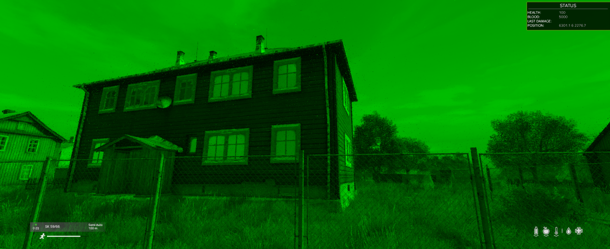

[**`back`**](../Readme.md#rings)
## Ring of Owl Level 1 (Type: TBJOFRingOfOwlLevel1)

## Ring of Owl Level 2 (Type: TBJOFRingOfOwlLevel2)

## Ring of Owl Level 3 (Type: TBJOFRingOfOwlLevel3)

## Night Vision Ring of Owl Level 1 (Type: TBJOFRingOfOwlLevel1)

## Night Vision Ring of Owl Level 2 (Type: TBJOFRingOfOwlLevel2)

## Night Vision Ring of Owl Level 3 (Type: TBJOFRingOfOwlLevel3)

## Negative Effect all Ring of Owl Level (Type: TBJOFRingOfOwl)
