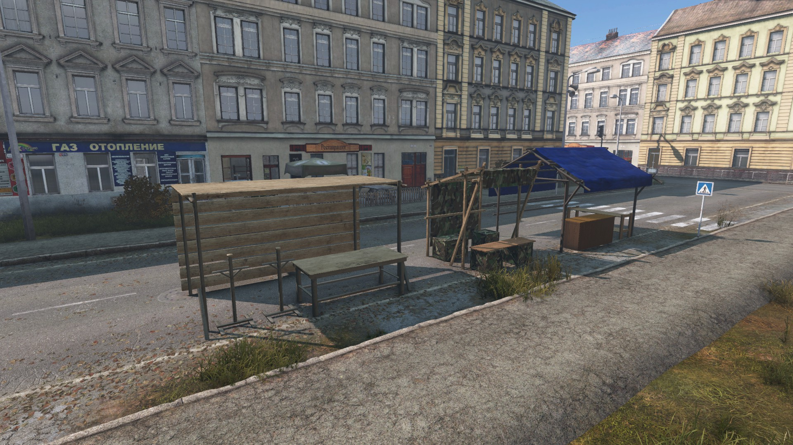
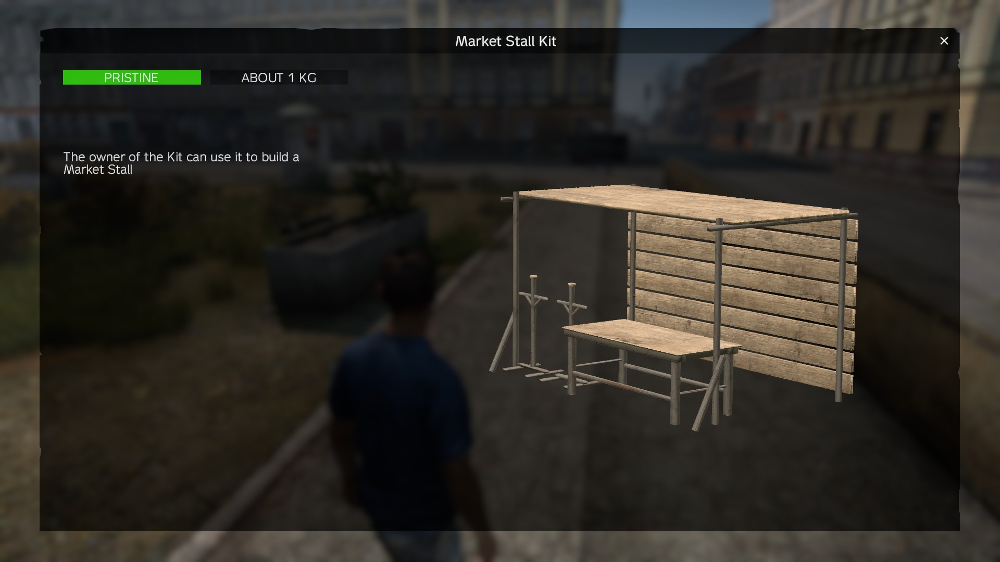
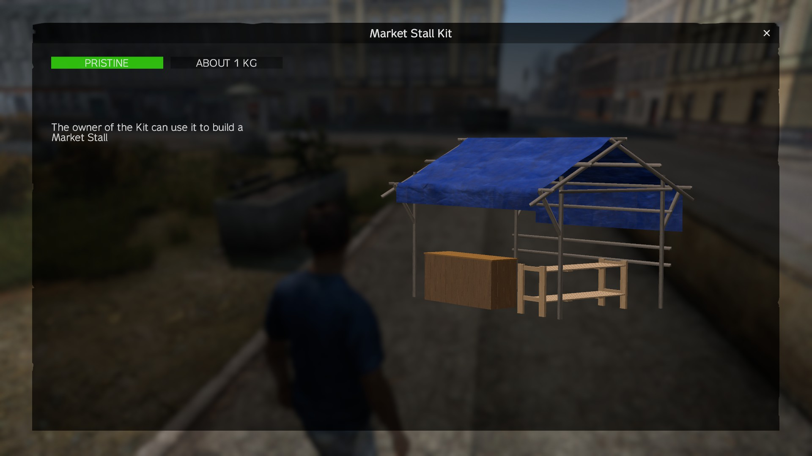
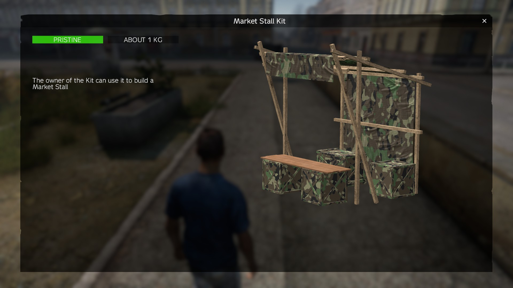
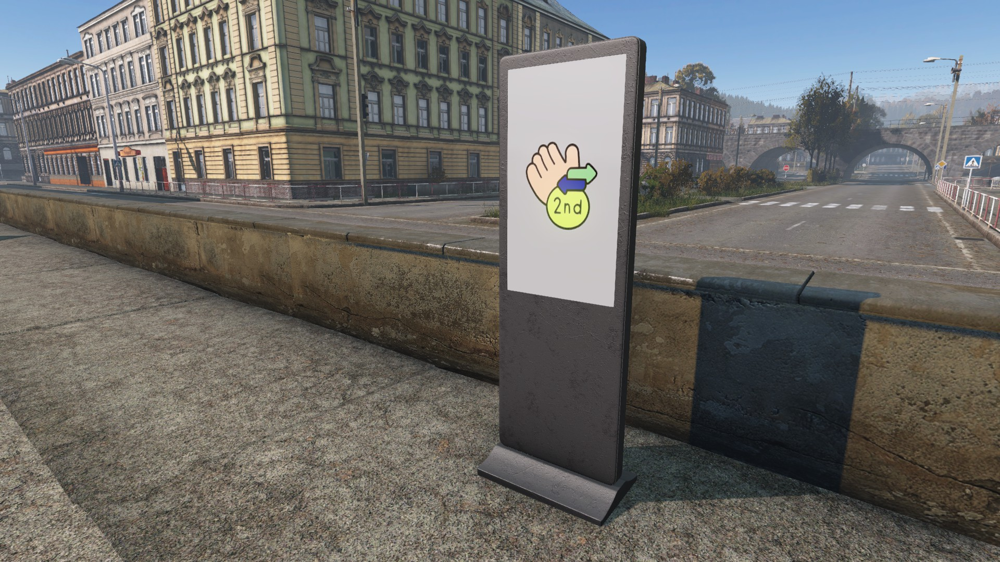

# TB Second Hand Market

## Description

Player can easily sell items to other players.

## Shop Link

https://lbmaster.de/product.php?id=37

## Support

If you need any support, please open a ticket here: https://discord.gg/kGjN6gJy3m

## Youtube

Will follow soon

## Features

- Premium Feature
    - Premium Users can pay less for buying a Market Stall
    - Premium Users can have more placed Market Stalls at same time
    - Premium Users can have more slots in their Market Stalls
    - if premium status changed, the values to already stalls/stall kit that player have, will adapt 
- Can trade any item or vehicle
- Items can be blacklisted
- (optional) Whitelisted Areas for placing Market Stalls
- Slot counts of Stalls can be configured
- Lifetime of Stalls can be configured
- Price of Stalls can be configured
- 3 different Stall Models
- Player can create offers for items
- Player can create orders for items
- Admin can access all Stalls and manage them
- Different Logs (some logs are currently on development) 
- A lot of logging options
- Admin can reload the config and data at Market Stall dealer

## Planed Features
- Bullet Board for overview of all Stalls and what they offer
- Navigation to Stalls from Bullet Board

## FAQ

### How to install

- Take the Server PBO and bring it into your own server side pack
- Take the Client PBO and bring it into your own client pack. Publish this Pack on steam.
- Start the server and stop it again if all configs are generated
- Configure your needs
- Start your Server :-)

## Types.xml

### At this object player can buy a Market Stall
- TBSHM*
- TBSHMCashier
- TBSHMPokladna
- TBSHMPultskasou

### Kits that player can buy at Market Stall Dealer
- TBSHMStand_01_Kit
- TBSHMStand_02_Kit
- TBSHMStand_03_Kit

### Placed Market Stall objects
- TBSHMStand_01
- TBSHMStand_02
- TBSHMStand_03

### Premium Coins
- TBSHMPremiumCoinBronze
- TBSHMPremiumCoinSilver
- TBSHMPremiumCoinGold

## Configs

- [**`AdminConfig.json`**](../GlobalConfigs/Readme.md#adminconfigjson)
- [**`CurrencyConfig.json`**](../GlobalConfigs/Readme.md#currencyconfigjson)
- [**`ItemBlackList.json`**](./Configs/ItemBlackList.md)
- [**`Logger.json`**](./Configs/Logger.md)
- [**`StallConfig.json`**](./Configs/StallConfig.md)

### Images

