# TB Second Hand Market

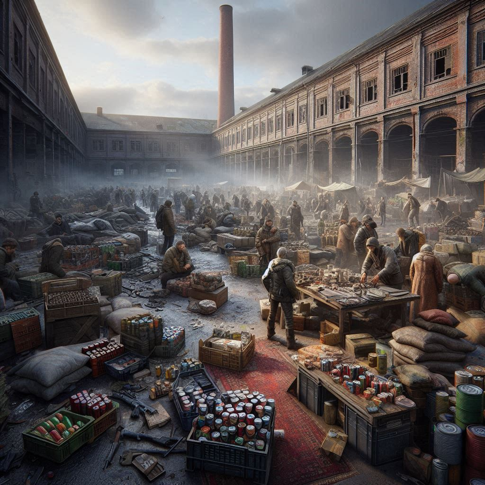

## Description

Player can easily sell items to other players.

## Shop Link

https://www.themodbase.com/mods/TBSecondHandMarket

## Support

If you need any support, please open a ticket here: https://discord.gg/kGjN6gJy3m

## Youtube

https://youtu.be/YXXO2QezOUU

## Features

### Shared Features (On Global or Player Stalls)
- Logging on Discord or CSV File
  - Buy a Stall
  - Place a Stall
  - Remove a Stall
  - Add an Offer
  - Add an Order
  - Remove an Offer
  - Remove an Order
  - Sell Item
  - Buy Item
  - Add Money to (Global) Stall
  - Remove Money from (Global) Stall
- Can trade any item or vehicle
- Blacklist for items that can not be traded
- Players can
  - create offers for items
  - create orders for items
  - can take money into and from global stall
  - can take filled orders from global stall
  - can buy items
  - can sell items
  - can manage there markers at bulletin board and (Global) stall
- Bulletin Board
  - Central Point to see all offers and orders
  - Players can create markers to offer/order
- Admin can
  - reload configs at global stall and stall dealer
  - delete offers/orders at bulletin board and at global stall
  - teleport from bulletin board to global stall
- All premium features are optional and can be disabled

### Global Stall
- 4 different Global Stall Models
- You can place multiple global stalls at different locations
- Global Stalls can share there offers and orders between other global stalls
- Global Stall offers and orders can be seen at the bulletin board
- orders and offers have a lifetime
- Premium Features
  - Premium Users can have more slots at global stall
  - Premium Users can pay fewer for slots
  - Premium Users orders and offers can have more lifetime
- Configuration
  - Global Stall Points
  - Shared Global Stall Storage
  - Slot Prices
  - Free Slots for Player
  - max. Slots for Player
  - lifetime of orders and offers

### Individual Stalls

- 4 different Stall Models
- 4 different Stall Dealer Models
- Premium Feature
    - Premium Users can pay less for buying a Market Stall
    - Premium Users can have more placed Market Stalls at same time
    - Premium Users can have more slots in their Market Stalls
    - if premium status changed, the values to already stalls/stall kit that player have, will adapt 
    - Premium Users can pay less for publishing on Bulletin Board
- Configuration
  - max. Stalls per Player 
  - max Stalls per Server
  - Blacklist for items that can not be traded
  - (optional) Whitelisted Areas for placing Market Stalls
  - Slot counts of Stalls 
  - Lifetime of Stalls 
  - Price of Stalls
- Players 
  - publish stall at bulletin board
- Admin 
  - can access all Stalls and manage them
  - can reload the config and data at Market Stall dealer
  - can manage and delete stalls

## FAQ

### How to install

See also [here](../The%20Mod%20Base/README.md)

- Take the Server PBO and bring it into your own server side pack
- Take the Client PBO and the TBLib PBO and bring it into your own client pack. Publish this Pack on steam.
- Start the server and stop it again if all configs are generated
- Configure your needs
- Start your Server :-)

### How to give player premium status?
see [**`Global FAQ`**](../GlobalConfigs/Readme.md#FAQ)

## Types
- [**`Types`**](Types.md)

## Configs

- [**`AdminConfig.json`**](../GlobalConfigs/Readme.md#adminconfigjson)
- [**`BulletinBoard.json`**](./Configs/BulletinBoard.md)
- [**`CurrencyConfig.json`**](../GlobalConfigs/Readme.md#currencyconfigjson)
- [**`DealerPoints.json`**](./Configs/DealerPoints.md)
- [**`GeneralConfig.json`**](./Configs/GeneralConfig.md)
- [**`ItemWhiteList.json`**](./Configs/ItemWhiteList.md)
- [**`ItemBlackList.json`**](./Configs/ItemBlackList.md)
- [**`GlobalStallConfig.json`**](./Configs/GlobalStallConfig.md)
- [**`ItemBlackList.json`**](./Configs/ItemBlackList.md)
- [**`Logger.json`**](./Configs/Logger.md)
- [**`StallConfig.json`**](./Configs/StallConfig.md)

### Images

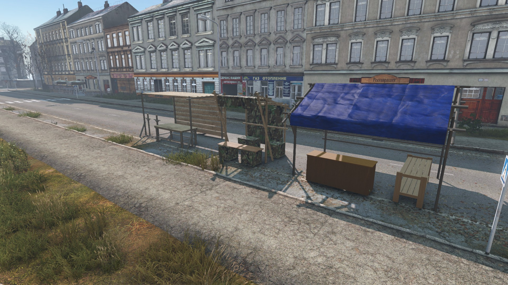
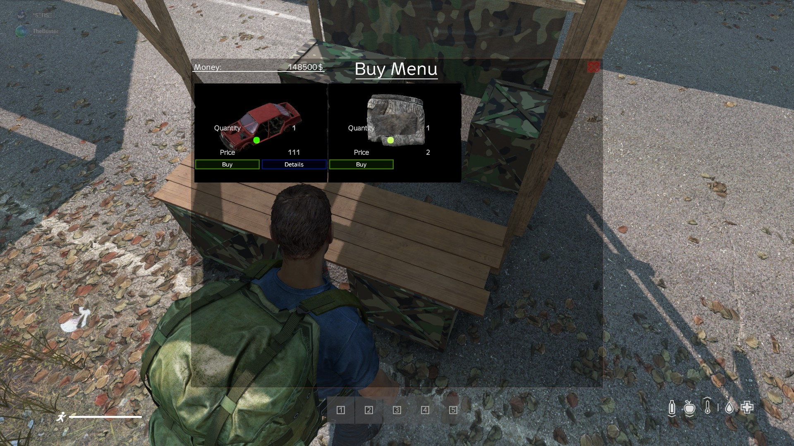
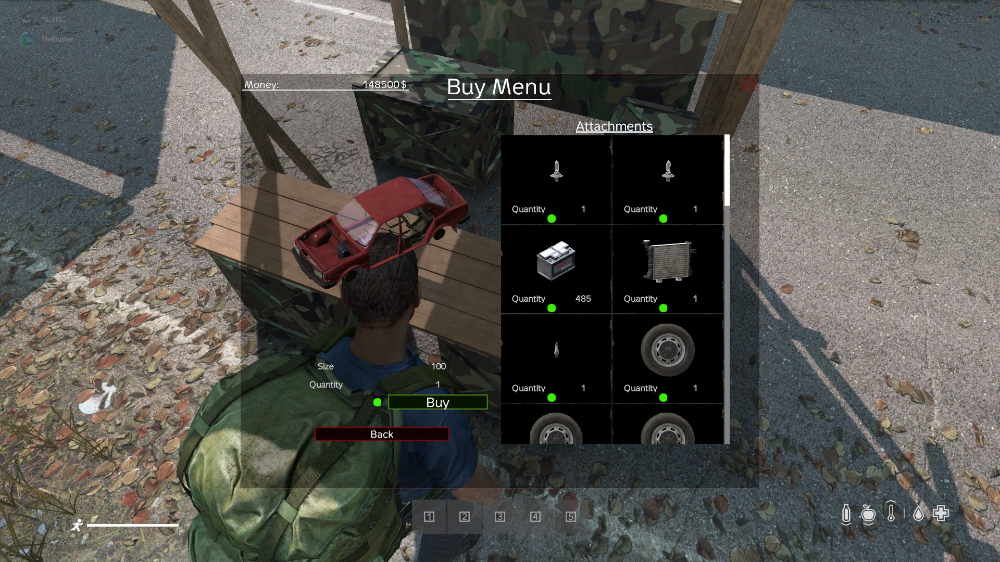
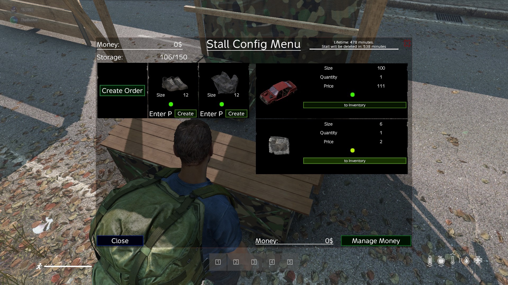
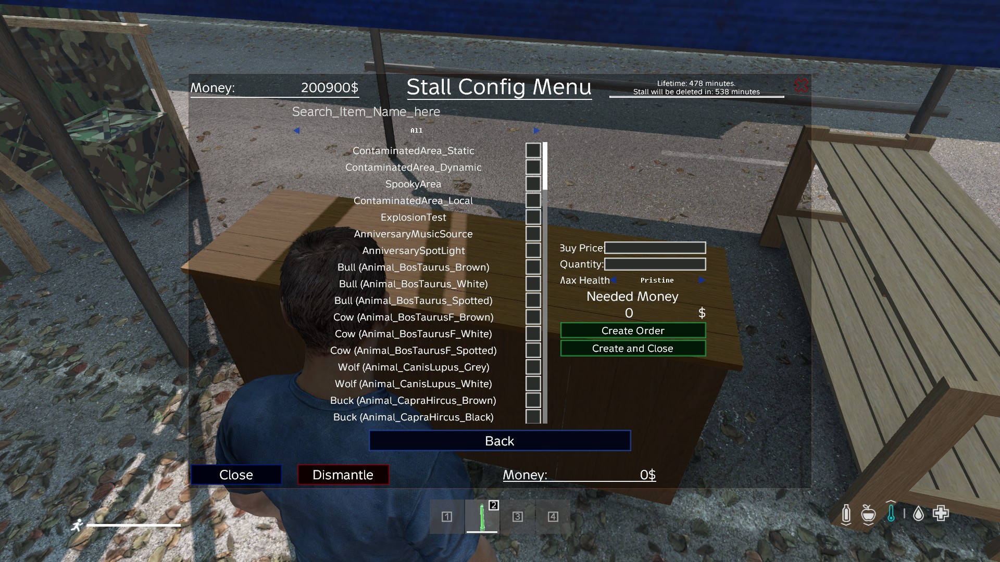
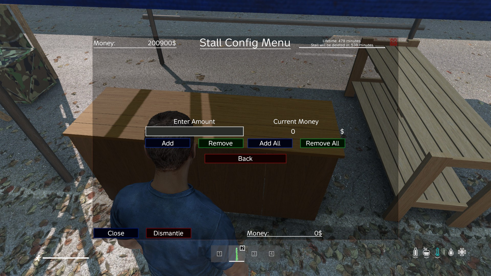
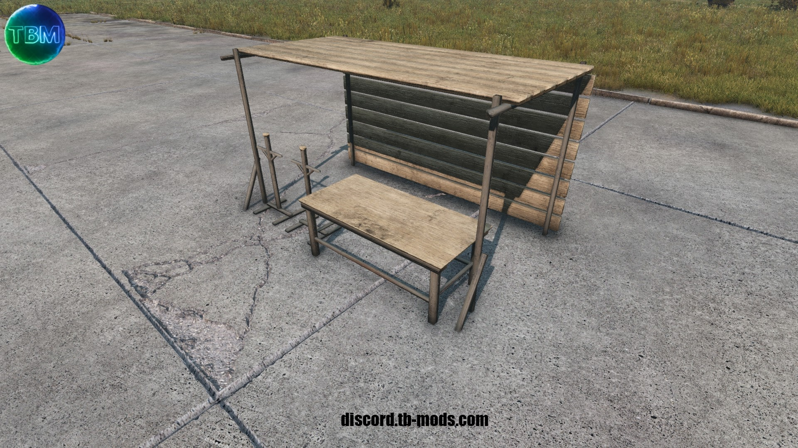
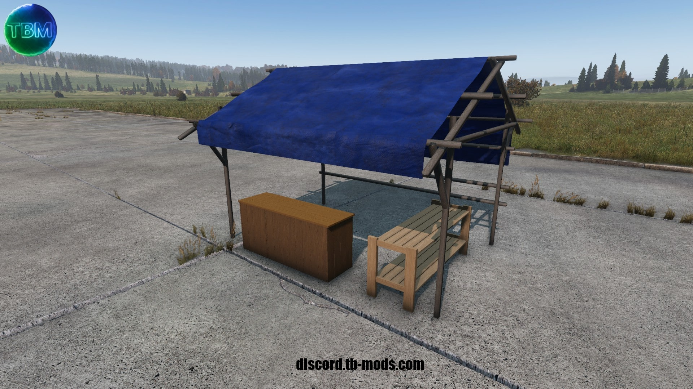
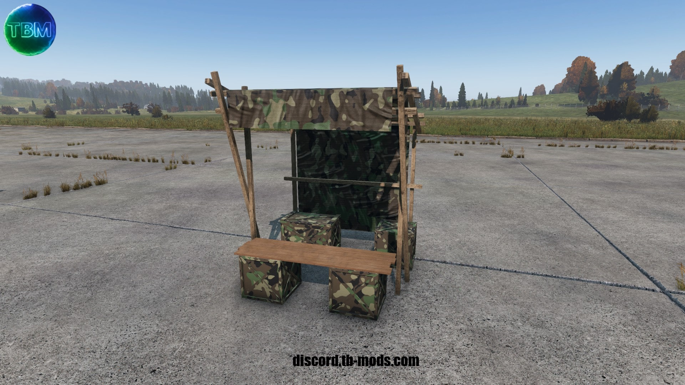
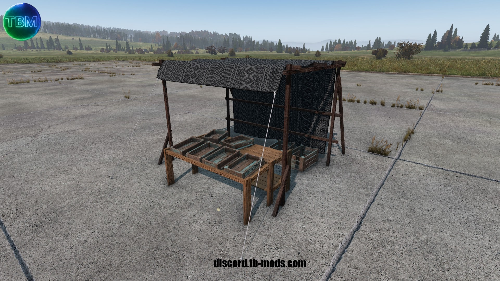
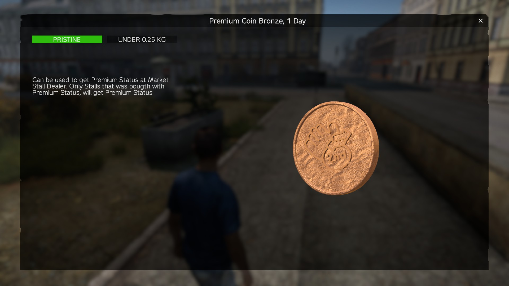
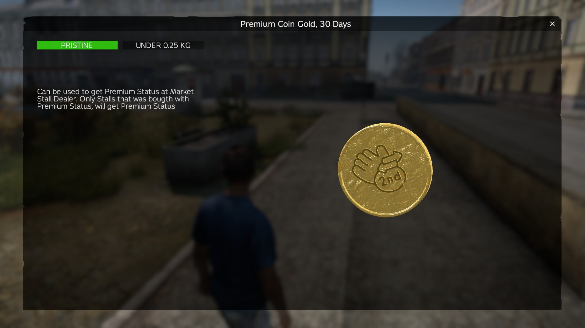
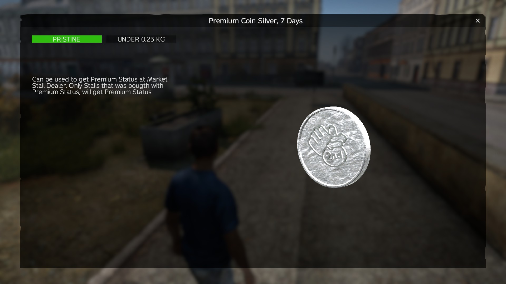
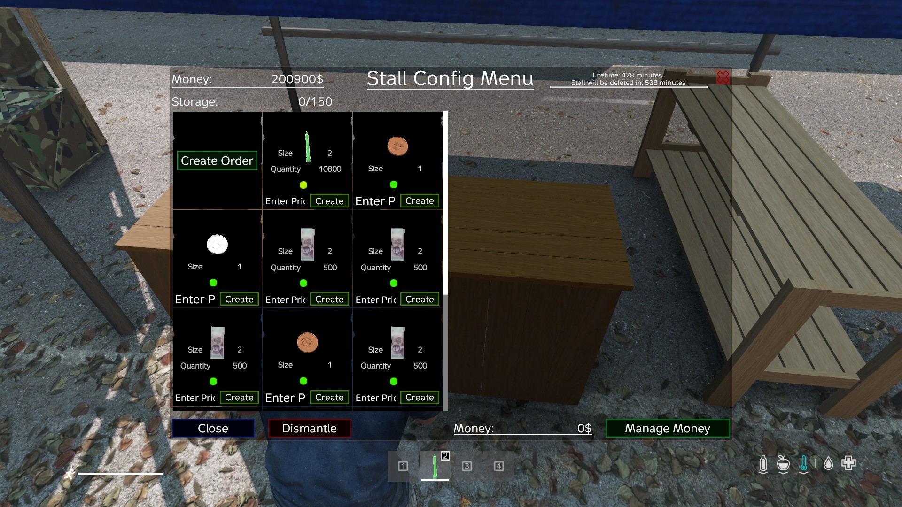
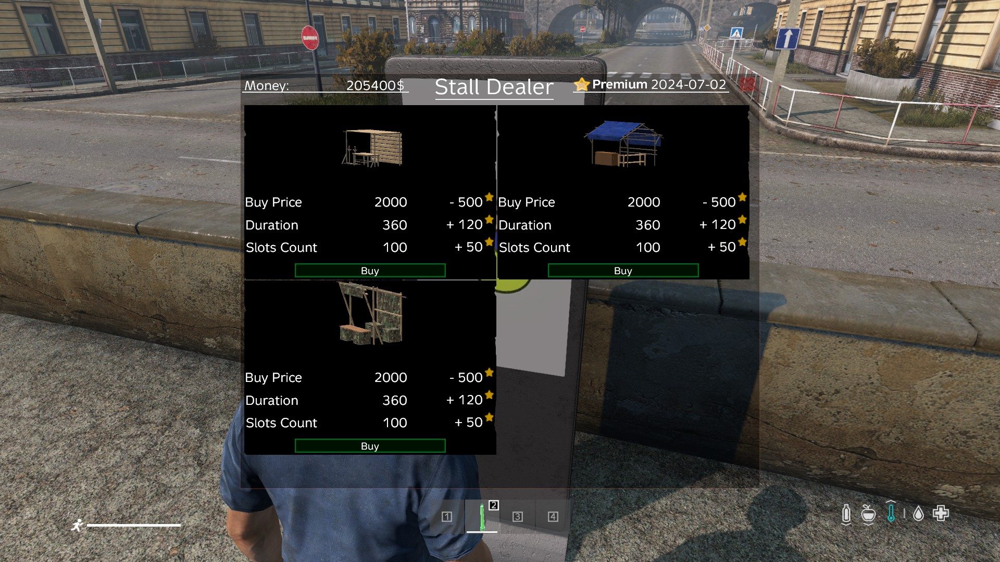
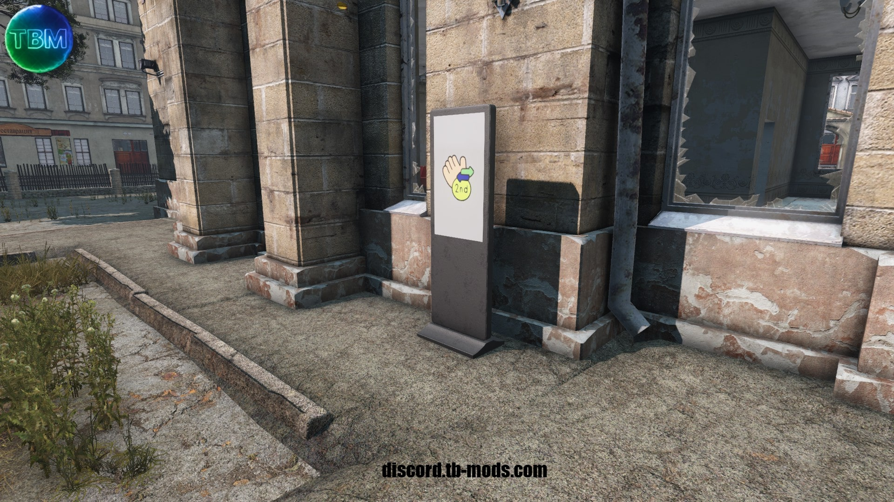
