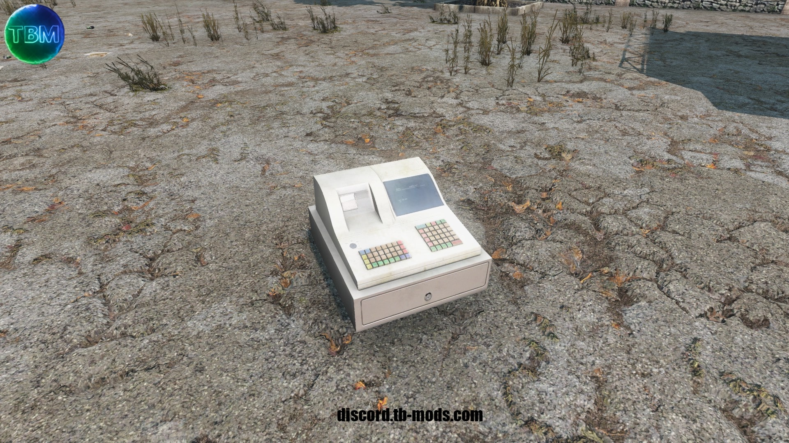
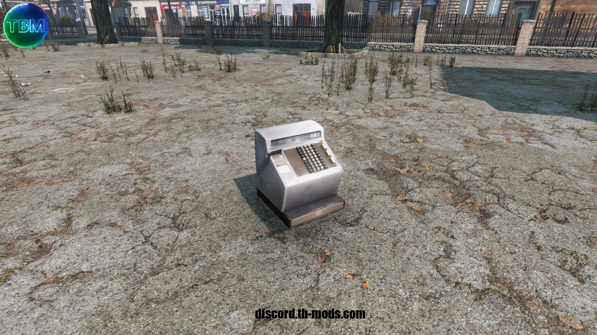
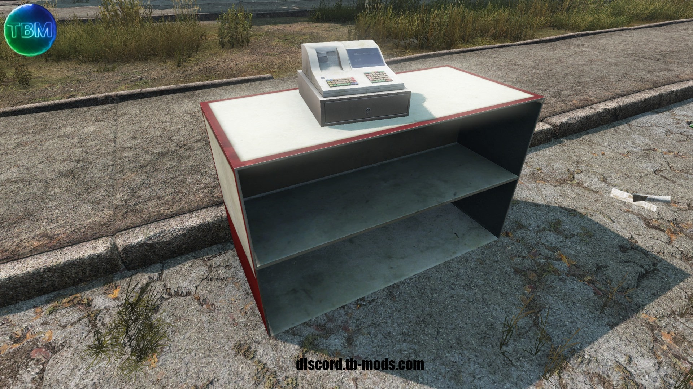
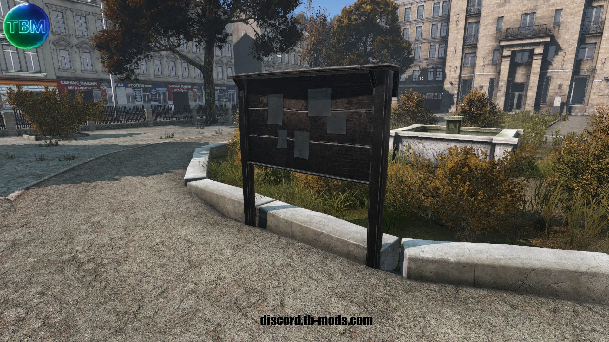

# Types.xml

## At this object player can buy a Market Stall (Stall Dealer Objects)

If you are using VPP Admin tool, you have to use the Object Builder to place thees.

- TBSHMMachine 
- TBSHMCashier 
- TBSHMPokladna 
- TBSHMPultskasou 

## Kits that player can buy at Market Stall Dealer
- TBSHMStand_01_Kit
- TBSHMStand_02_Kit
- TBSHMStand_03_Kit
- TBSHMStand_04_Kit

## Placed Market Stall objects

Can be bought at the Market Stall Dealer

- TBSHMStand_01 
- TBSHMStand_02 
- TBSHMStand_03 
- TBSHMStand_04 

## Global Stalls

Positions must be configured in the [**`DealerPoints.json`**](./Configs/DealerPoints.md) config file.

- TBSHMGlobalStall_01 
- TBSHMGlobalStall_02 
- TBSHMGlobalStall_03 
- TBSHMGlobalStall_04 

## Bulletin Board

If you are using VPP Admin tool, you have to use the Object Builder to place thees.

- TBSHMBulletinBoard 

## Premium Coins
- TBSHMPremiumCoinBronze 
- TBSHMPremiumCoinSilver 
- TBSHMPremiumCoinGold 

