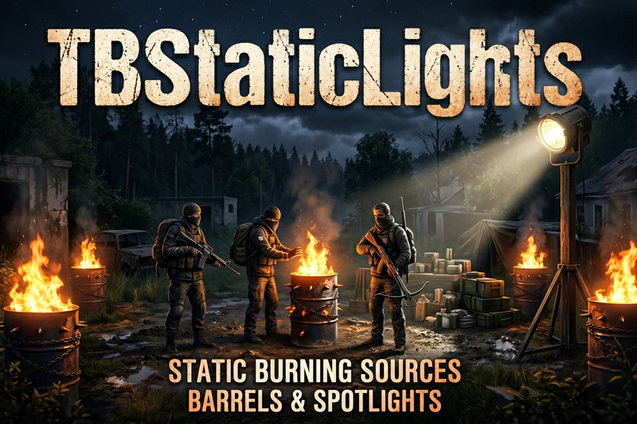

# TBStaticLights



### How to use.
- Place the Object with your Admin Tool.
- Go to the Object and open the Config Menu via F Action
- You can now set the height by just pressing once the rightmouse button to activate the move mode. The mouse move now changes the height. Once you are satisfied with the height press the rightmouse button again to deactivate it.
- You can now change the horizion by just press once the leftmouse button to activate move mode. The mouse move now changes the horizion. Once you are satisfied with the horizion press the leftmouse button again to deactivate it.
- In dropdown you can also change the type of the object.
** Dont forget to save it. Otherwise the object will not be available after server restart. **

### Types
- TBSLForeverAirfieldLamp
- TBSLForeverBurningBarrelBase
- TBSLForeverBurningBarrel_Green
- TBSLForeverBurningBarrel_Blue
- TBSLForeverBurningBarrel_Red
- TBSLForeverBurningBarrel_Yellow
- TBSLForeverFurnitureHangarLamp
- TBSLForeverFurnitureLuxuryLamp
- TBSLForeverHalogenLamp
- TBSLForeverLampHarbour
- TBSLForeverPowerPoleWood4Lamp
- TBSLForeverSpotlight
- TBSLForeverStadiumLamp


### Config

Path: `DayZServer\profiles\TBMods\Config\TBStaticLights\LightObjects.json`

```json line
{
    "adminObjects": [
        {
            "type": "TBSLForeverBurningBarrel_Blue", // type name
            "pos": [ // position X, Y, Z
                6540.8798828125,
                6.0229902267456059,
                2464.489990234375
            ],
            "rot": [ // rotation X, Y, Z
                9.9998197555542,
                0.0,
                -0.0
            ],
            "lightStates": [
                0
            ]
        },
        {
            "type": "TBSLForeverSpotlight", 
            "pos": [
                6540.31982421875,
                6.0229902267456059,
                2462.550048828125
            ],
            "rot": [
                215.0,
                0.0,
                -0.0
            ],
            "lightStates": [
                0
            ]
        },
        {
            "type": "TBSLForeverSpotlight",
            "pos": [
                6539.56005859375,
                6.0229902267456059,
                2461.909912109375
            ],
            "rot": [
                339.99798583984377,
                0.0,
                -0.0
            ],
            "lightStates": [
                0
            ]
        }
    ]
}
```