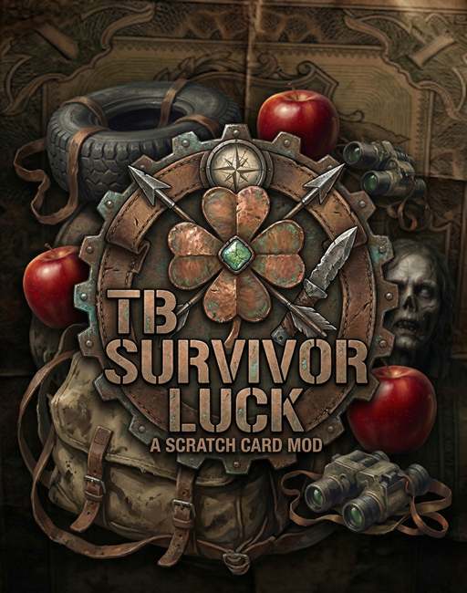

# TBSurvivorLuck

This mod allows you to win items by scratching a scratch card.

## Features
Full list of features can be found at [Shop](https://www.themodbase.com/mods/TBSurvivorLuck)

## Shop Link
https://www.themodbase.com/mods/TBSurvivorLuck

## Support

If you need any support, please open a ticket here: https://discord.gg/kGjN6gJy3m

## Youtube

[TBSurvivorLuck](https://youtu.be/UGkJvDl_TLU)

### How to install

See also [here](../The%20Mod%20Base/README.md)

- Take the Server PBO and add it to your own server-side pack.
- Take the Client PBO and the TBLib PBO and add them to your own client pack. Publish this pack on Steam.
- Start your server. Additional configurations will be generated.
- Shut down the server.
- Configure your needs.
- Start your server :-)

### Configuration Options
- A wide range of configuration possibilities.
- Config files will automatically be created on the first server start.

### Types
- TBSLScratchCard

### Configs
- [ScratchCardConfig.md](./Configs/ScratchCardConfig.md)
