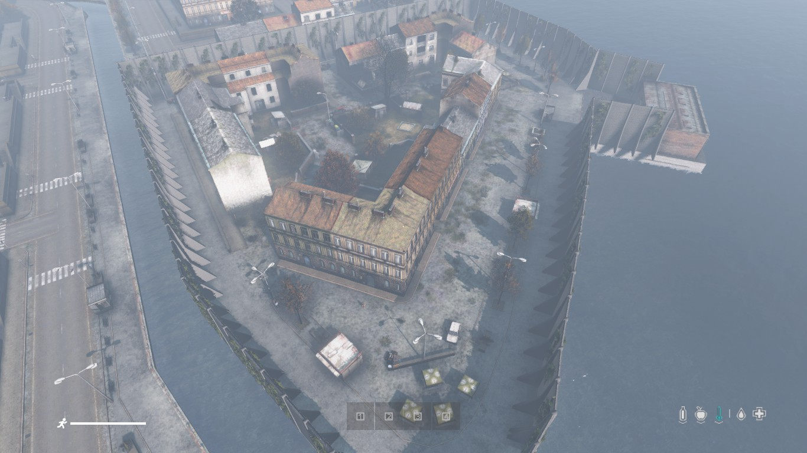
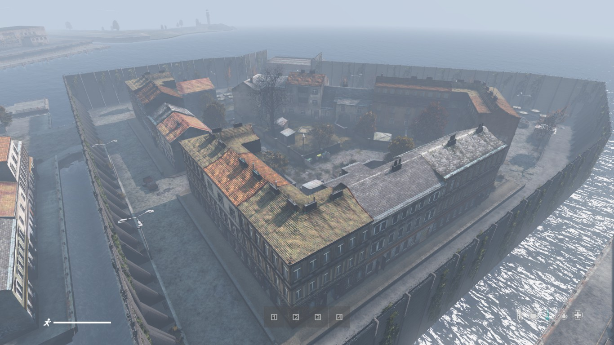
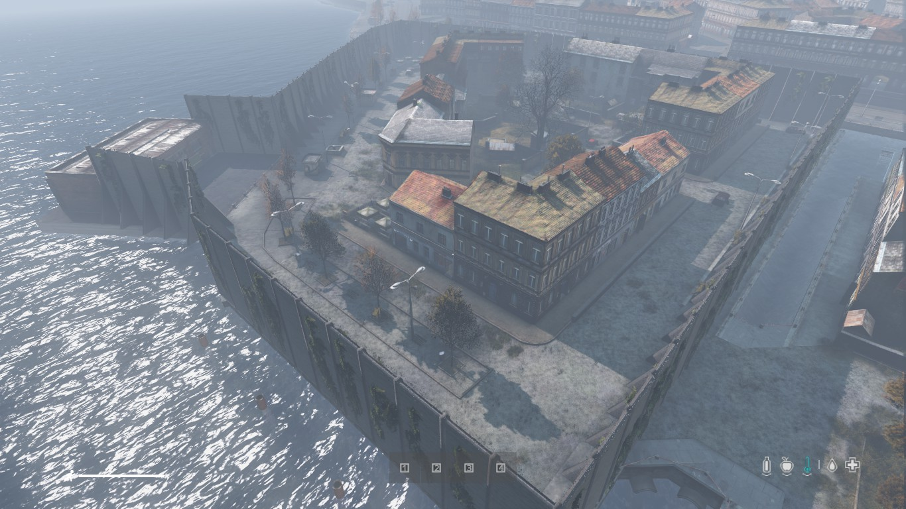
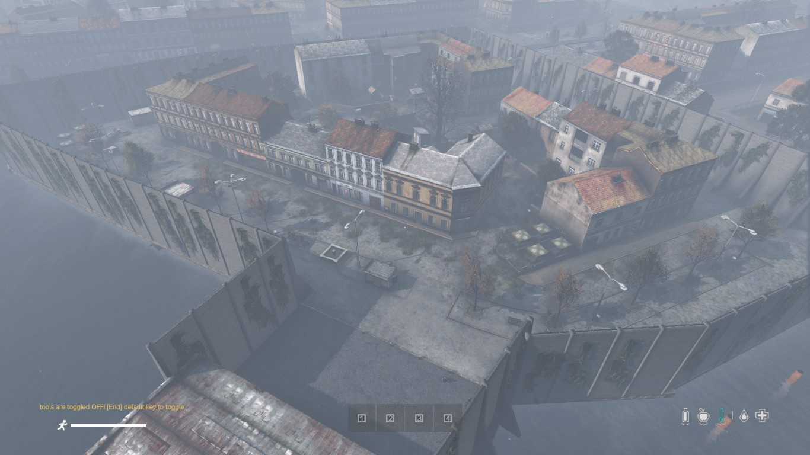

# Cherno

## Files

<a href="./ArenaBuildingConfig/Cherno.json" download>Arena buildings Config</a>

<a href="./ArenaMatchConfig/Cherno.json" download>Arena Match Config</a>

## Required Mod Packs 
- BuilderItems (https://steamcommunity.com/sharedfiles/filedetails/?id=1565871491)
- SPBuilding (https://steamcommunity.com/sharedfiles/filedetails/?id=2177232791)

## Screenshots






## How to use
- Copy the `Cherno.json` from `Config\ArenaBuildingConfigs` into your `YourServerProfilesFolder\TBMods\Config\TBWarParty\ArenaBuildingConfigs\` folder.
- Copy the `Cherno.json` folder from `Config\ArenasMatchConfigs` into your `YourServerProfilesFolder\TBMods\Config\TBWarParty\ArenasMatchConfigs\` folder.
- Add in your `YourServerProfilesFolder\TBMods\Config\TBWarParty\MainConfig.json` at `arenaFileNames` the `Cherno` line:
```json
  "arenaFileNames": [
        "OterArenas",
        "Cherno",
  ],
```
- Reload the config in game over admin menu or restart the server.