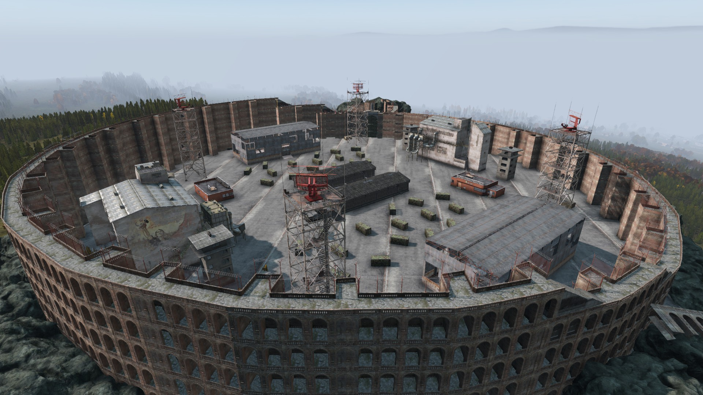
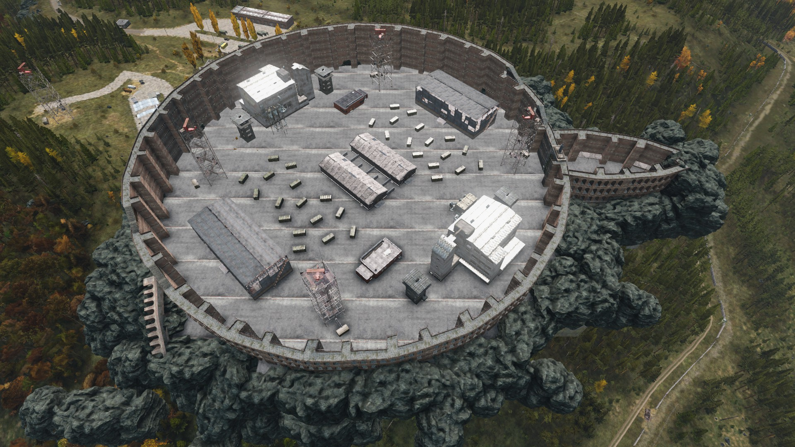

# Colosseum

## Files

<a href="./ArenaBuildingConfig/Colosseum.json" download>Arena buildings Config</a>

<a href="./ArenaMatchConfig/Colosseum.json" download>Arena Match Config</a>

<a href="./Colosseumfinish.c" download>C File of Arenabuildings</a>

## Required Mod Packs
- BuilderItems (https://steamcommunity.com/sharedfiles/filedetails/?id=1565871491&searchtext=Builder+Irems)

## Screenshots




## How to use
- Copy the `Colosseum.json` from `Config\ArenaBuildingConfigs` into your `YourServerProfilesFolder\TBMods\Config\TBWarParty\ArenaBuildingConfigs\` folder.
- Copy the `Colosseum.json` folder from `Config\ArenasMatchConfigs` into your `YourServerProfilesFolder\TBMods\Config\TBWarParty\ArenasMatchConfigs\` folder.
- Add in your `YourServerProfilesFolder\TBMods\Config\TBWarParty\MainConfig.json` at `arenaFileNames` the `Colosseum` line:
```json
  "arenaFileNames": [
        "OterArenas",
        "Colosseum",
  ],
```
- Reload the config in game over admin menu or restart the server.