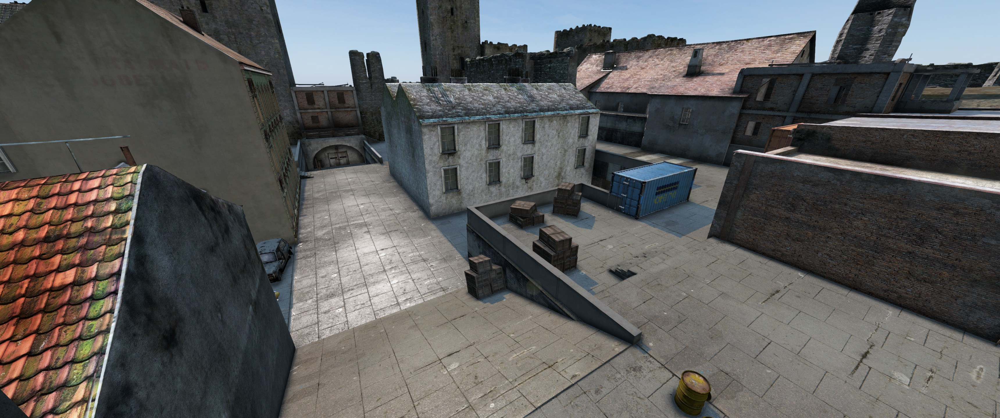
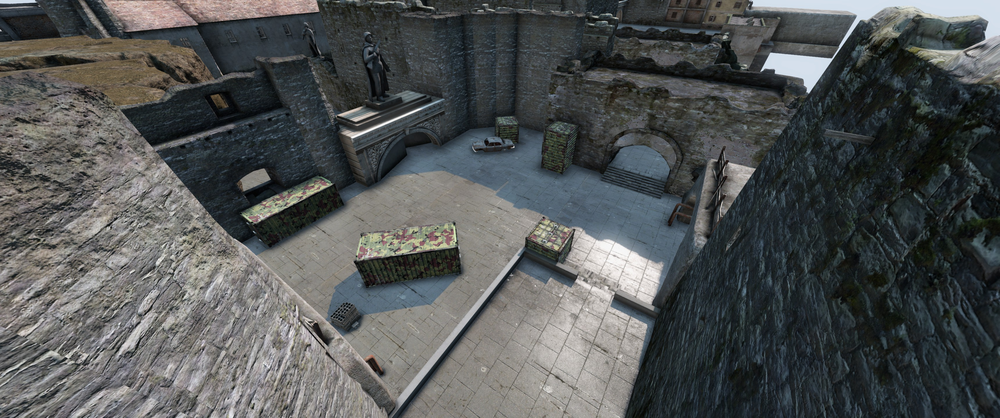
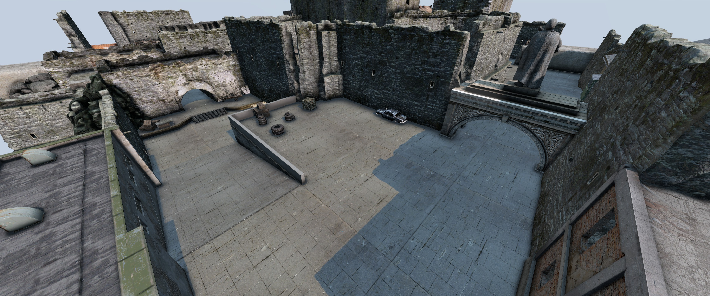
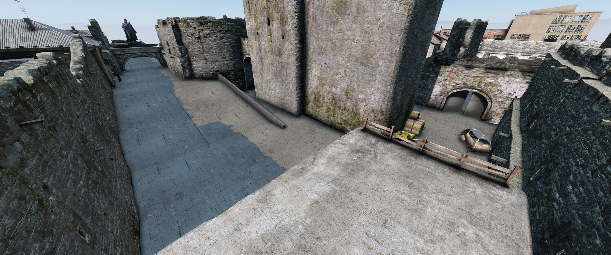
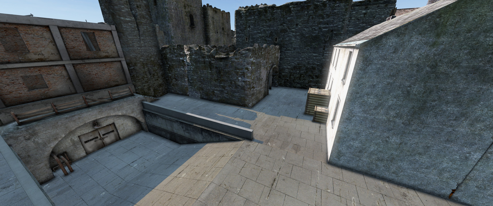
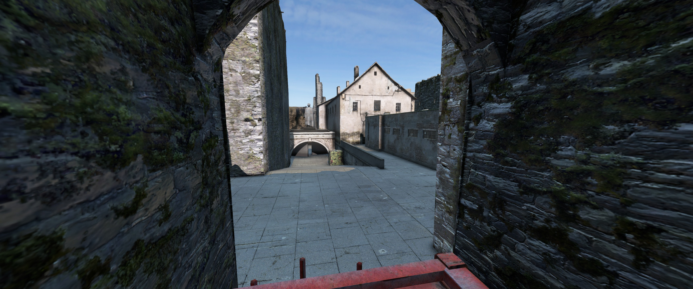
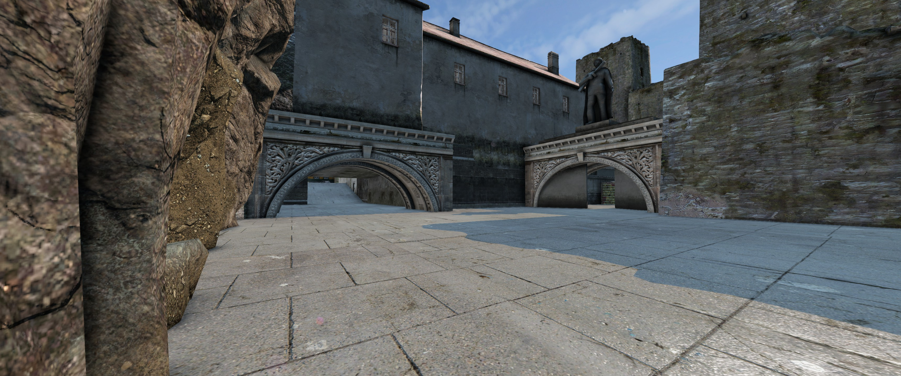

# PVP Arena DUST 2

## Files


[Arena Editot DZE file Cherno](https://raw.githubusercontent.com/ihr-it-projekt/DayZModsInfo/main/TBWarParty/Arenas/Dust2/Config/EditorFiles/Dust2.dze){target="_blank" download}

[Arena Editot DZE file PNW 2.0 Map](https://raw.githubusercontent.com/ihr-it-projekt/DayZModsInfo/main/TBWarParty/Arenas/Dust2/Config/EditorFiles/pnw/Dust2.dze){target="_blank" download}

[Arena Match Config](https://raw.githubusercontent.com/ihr-it-projekt/DayZModsInfo/main/TBWarParty/Arenas/Dust2/Config/ArenaMatchConfigs/Dust2.json){target="_blank" download}


## Required Mod Packs

- BuilderItems (https://steamcommunity.com/sharedfiles/filedetails/?id=1565871491)
- DayZ Editor Loader (https://steamcommunity.com/sharedfiles/filedetails/?id=2276010135&searchtext=DayZ+Editor)
- Dabs Framework (https://steamcommunity.com/sharedfiles/filedetails/?id=2545327648&searchtext=Dabs+Framework)

## Screenshots









## How to use
- Copy the `Dust2.dze` from `Config\EditorFiles` into your `YourServer\MPMissions\MAP\EditorFiles\` folder.
- Copy the `Dust2.json` folder from `Config\ArenasMatchConfigs` into your `YourServerProfilesFolder\TBMods\Config\TBWarParty\ArenasMatchConfigs\` folder.
- Add in your `YourServerProfilesFolder\TBMods\Config\TBWarParty\MainConfig.json` at `arenaFileNames` the `Dust2` line:
```json
  "arenaFileNames": [
        "OterArenas",
        "Dust2",
  ],
```
- Reload the config in game over admin menu or restart the server.