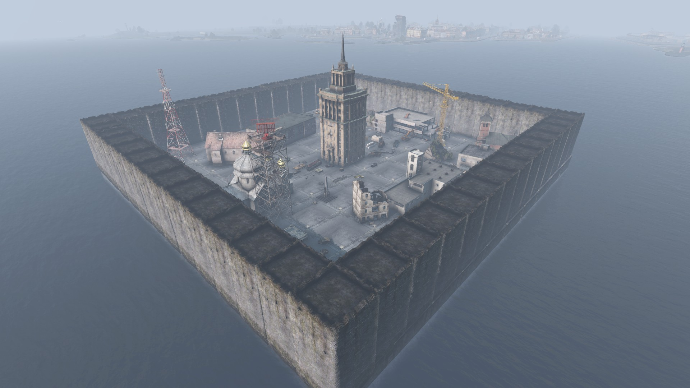
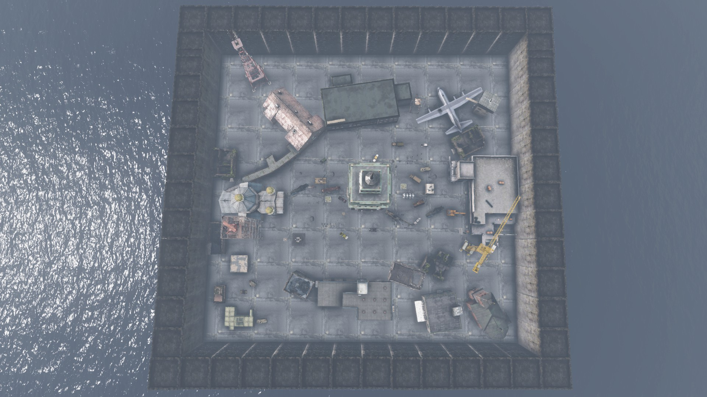

# Nowhere

## Required Mod Packs
- BuilderItems (https://steamcommunity.com/sharedfiles/filedetails/?id=1565871491)

## Screenshots




## How to use
- Copy the `Nowhere.json` from `Config\ArenaBuildingConfigs` into your `YourServerProfilesFolder\TBMods\Config\TBWarParty\ArenaBuildingConfigs\` folder.
- Copy the `Nowhere.json` folder from `Config\ArenasMatchConfigs` into your `YourServerProfilesFolder\TBMods\Config\TBWarParty\ArenasMatchConfigs\` folder.
- Add in your `YourServerProfilesFolder\TBMods\Config\TBWarParty\MainConfig.json` at `arenaFileNames` the `Nowhere` line:
```json
  "arenaFileNames": [
        "OterArenas",
        "Nowhere",
  ],
```
- Reload the config in game over admin menu or restart the server.