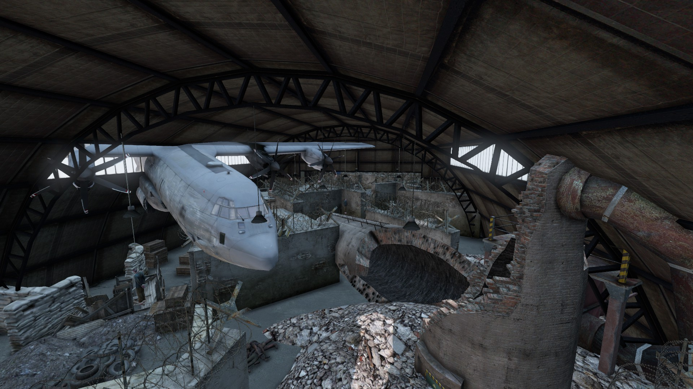
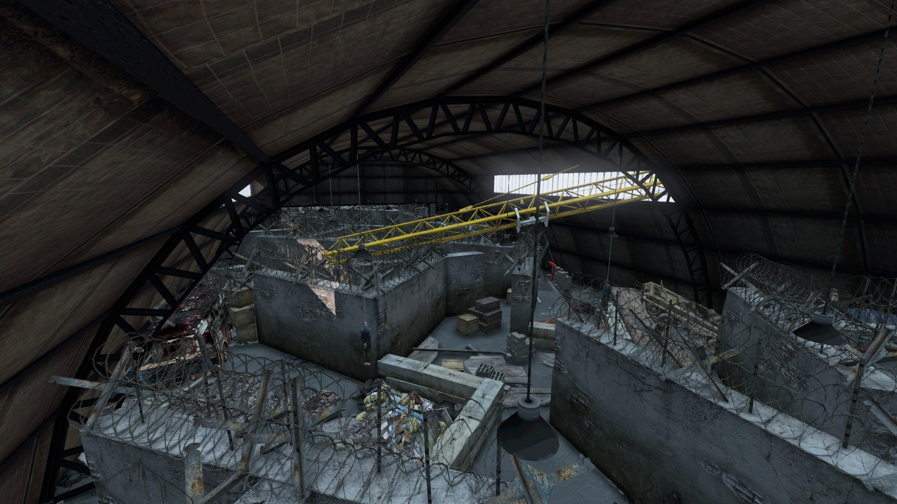

# War Arena PVP Hanger

## Files

<a href="./ArenaBuildingConfig/warareanaPVPhangar.json" download>Arena buildings Config</a>

<a href="./ArenaMatchConfig/warareanaPVPhangar.json" download>Arena Match Config</a>

## Required Mod Packs

- BuilderItems (https://steamcommunity.com/sharedfiles/filedetails/?id=1565871491)
- DayZ Editor Loader (https://steamcommunity.com/sharedfiles/filedetails/?id=2276010135&searchtext=DayZ+Editor)
- Dabs Framework (https://steamcommunity.com/sharedfiles/filedetails/?id=2545327648&searchtext=Dabs+Framework)

## Screenshots




## How to use
- Copy the `warareanaPVPhangar.dze` from `Config\EditorFiles` into your `YourServer\MPMissions\MAP\EditorFiles\` folder.
- Copy the `warareanaPVPhangar.json` folder from `Config\ArenasMatchConfigs` into your `YourServerProfilesFolder\TBMods\Config\TBWarParty\ArenasMatchConfigs\` folder.
- Add in your `YourServerProfilesFolder\TBMods\Config\TBWarParty\MainConfig.json` at `arenaFileNames` the `warareanaPVPhangar` line:
```json
  "arenaFileNames": [
        "OterArenas",
        "warareanaPVPhangar",
  ],
```
- Reload the config in game over admin menu or restart the server.