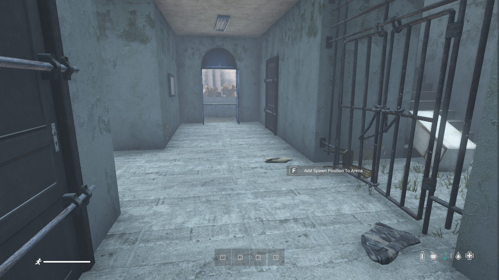
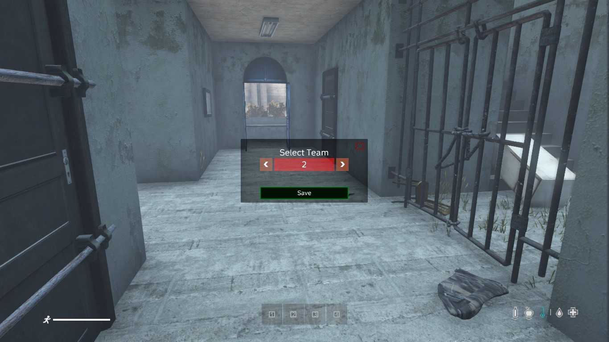
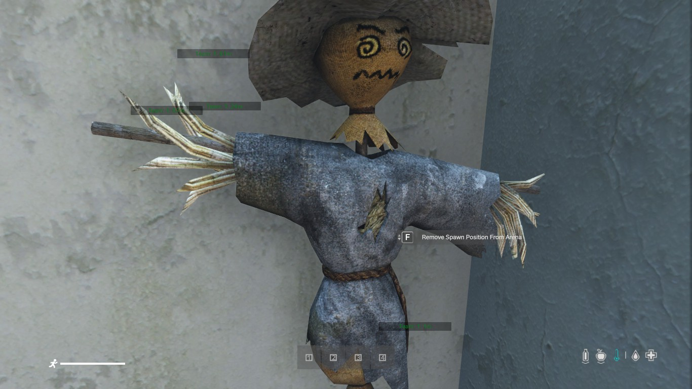
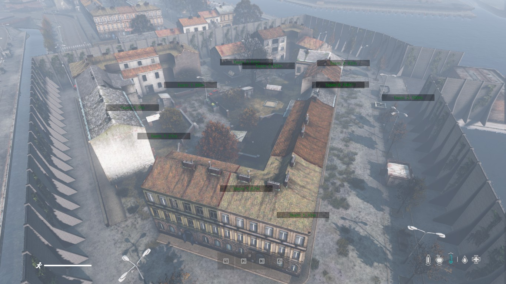

[back](Index.md)

# ArenaMatchConfigs

If you want to add/remove Spawn coordinates, you can do this also easy in game.

## Index
- [Spawn Points editing](#spawn-points-editing)
- [Config](#config)

## Spawn Points editing

- Be sure you ara an mod admin [Readme.md](../../GlobalConfigs%2FReadme.md)
- Join Main Lobby and create a match
- click on "Port to Arena" Button. Only visible if you are an admin
- The F Action is now usable
- Go to position where you want to add/remove a new spawn point
- Select Action and press F
- Choose the team you want to add the spawn point at the menu
- click on "Save"

<br/>
*Add a Spawn Position Action*<br/>
<br/>
*Confirm Add Spawn Position*<br/>
<br/>
*Remove a Spawn Position Action*<br/>
<br/>
*Spawn Positions overview*<br/>

After adding the new spawn points, you must reload the configurations via Admin Menu.
If you want to add ne positions for other teams, just cut and copy the coordinates from Team 1

## Config

````json lines
{
    "version": "1", // never change this, internal version number
    "isInitialized": 1, // never change this. Internal usage
    "arenaObjectsConfigFile": "Colosseum", // Name of the arena, will use to display the name in game. You can also load your arena via DayZ Editor Loader, it is not needed to add the file name here. Leave it empty if no arena objects should be loaded by TBWarParty 
    "playersCount": [ // how many players can join a match, this value will use to set the min and max players for a match
        10,
        15
    ],
    "roundsCount": [ // how many rounds will be played in a match
        1,
        2
    ],
    "deathPenaltyTimeInSeconds": [ // player has to wait a configured time before he can respawn 
        1,
        2,
        3,
        5,
        10
    ],
    "maxTimePerRoundInMinutes": [ // how long a round maximum will take in minutes
        5,
        10
    ],
    "maxKillsPerRound": [ // how many kills are needed to win a round. This value counts for team kills or in against all mode for player kills.
        3,
        5
    ],
    "startingFee": [ // currently not used but will be used in the future
        1000,
        2000,
        3000,
        5000,
        10000
    ],
    "teamWinRatio": [ // currently not used but will be used in the future
        {
            "place": 1,
            "ratio": 0.5
        },
        {
            "place": 2,
            "ratio": 0.30000001192092898
        }
    ],
    "enableChangeSides": 1, // currently not used but will be used in the future
    "enableOneLifeMode": 1, // currently not used but will be used in the future
    "enableShowTeamMarker": 1, // currently not used but will be used in the future
    "enableStaminaMode": 1, // currently not used but will be used in the future
    "enableShowSpectatorMode": 1, // currently not used but will be used in the future
    "gearSetNames": [ // name the gear sets, must be the same name as your gear set file name. See here for more information: GearSets.md
        "Example1",
        "Example2"
    ],
    "gearSets": [], // internal usage, do not change
    "externalPlayersCanEnterArena": 0, // currently not used but will be used in the future
    "adminCanEnterArena": 1, // currently not used but will be used in the future
    "enableMultipleGearSets": 1, // Match creator can choose multiple gear sets for a match if value is 1. If value is 0, only one gear set can be chosen.
    "showArenaBoarderPoints": 1, // currently not used but will be used in the future
    "teamSpawnZones": { // here must all team spawn zones insert, If you want to have more then 2 teams, you must add more team spawn zones.
      // Start first team
        "1": [
            {
                "position": [
                    3871.87109375,
                    396.7033386230469,
                    11775.6171875
                ],
                "orientation": [
                    32.31016159057617,
                    0.0,
                    -0.0
                ],
                "radius": 10.0 // how big the spawn zone is, value must be positive
            },
            {
                "position": [
                    3971.87109375,
                    396.7033386230469,
                    11778.6171875
                ],
                "orientation": [
                    32.31016159057617,
                    0.0,
                    -0.0
                ],
                "radius": 1.0
            }
        ],
      // Start next team
        "2": [
            {
                "position": [
                    3987.601318359375,
                    396.28509521484377,
                    11882.591796875
                ],
                "orientation": [
                    -130.3587646484375,
                    0.0,
                    -0.0
                ],
                "radius": 10.0
            }
        ]
    },
    "teamsCount": [], // internal usage, do not change
    "playerHealth": 100, // how much health a player has
    "playerShield": 100, // how much shield a player has, shield are automatically regenerate after a period of time
    "startCountdown": 60, // how long the countdown will be to start the match after enough players are available, must be at least 6 seconds
    "startNextRoundCountdown": 20, // how long the countdown will be to start the next round, must be at least 6 seconds
    "endMatchCountdown": 10 // how long the countdown will be to end the match, must be at least 6 seconds
}
````

[back](Index.md)