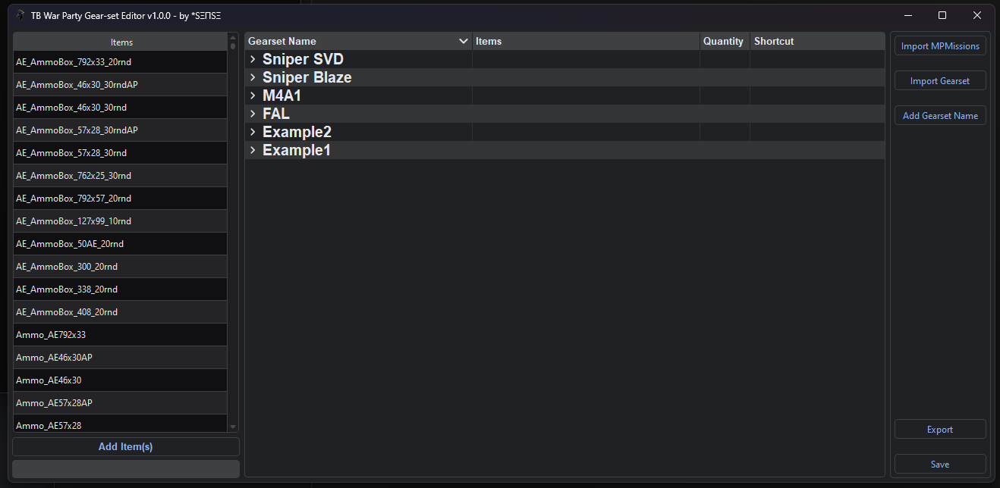
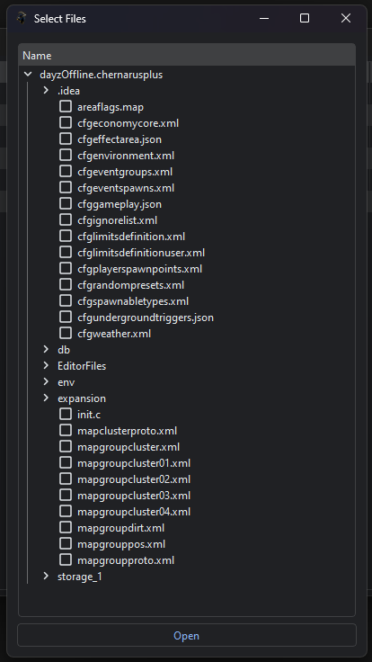
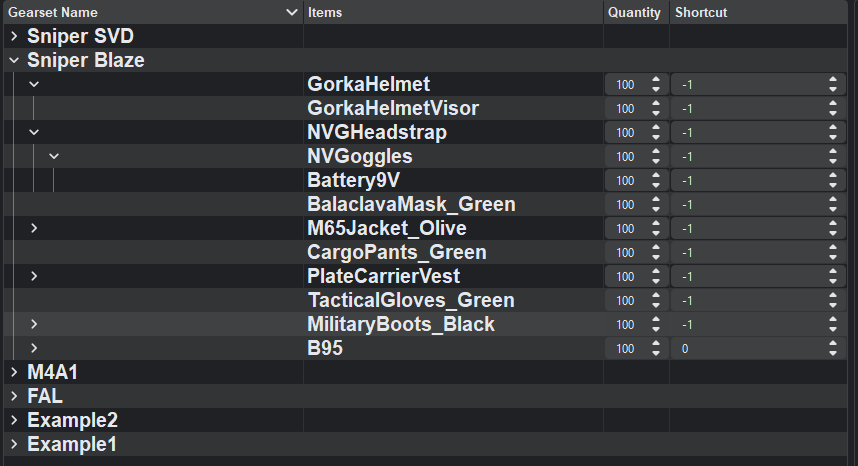

# TB Car Dealer Editor

## Download

- [TB War Party Gear-set Editor](./TBWarPartyGearsetEditor.rar)

## Description
### How to use the TB War Party Gear-set Editor

- 📁 **Import** your `DayZ Server/MPmission/Map` folder.
  (e.g., `dayzOffline.chernarusplus`, `dayzOffline.enoch`, or `dayzOffline.sakhal` etc.)
- 📑 **Select** your `.xml` files to load. (Only XML files similar to `types.xml` are accepted.)
- ➕ Use **Add Gearset Name** to create a new gearset.
- 🖱️ **Select** a gearset by left-clicking on it.
- ➕ Use **Add Item** to add the selected items to the chosen gearset.
- 🖱️📦 Items can also be moved as attachments to another item using **drag and drop**.
- ❌ **Delete** a gearset or item by selecting it and pressing the `Delete` key.
  - ⚠️ **Warning:** Deleting gearsets or items is **irreversible**.
- 📤 **Export** functionality should be straightforward; select the folder where you want to export your files.
- 📥 **Import** is also straightforward; choose the `.json` files of the gearsets you wish to import.
- 💾 **IMPORTANT:** Always click **Save** before exporting.

