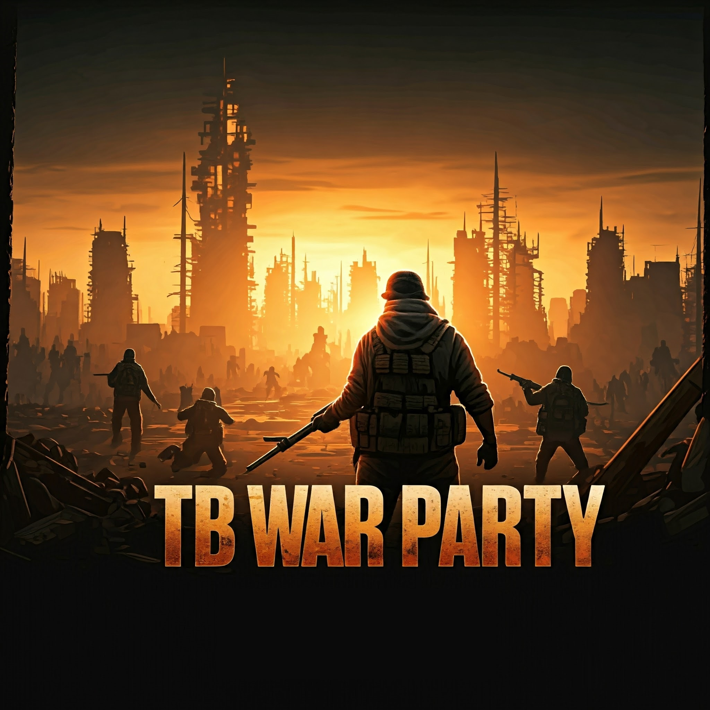

# TB War Party

 

## Description

Player can make different fights in an arena in Teams or against each other with multiple possibilities on configuration. 

## Shop Link

https://lbmaster.de/product.php?id=39

## Support

If you need any support, please open a ticket here: https://discord.gg/kGjN6gJy3m

## Youtube

Will come when mod is in stable version

## Configs

[Configs](Configs/Index.md)

## Arenas
[Arenas](Arenas/README.md)

## Tools

### Arena Building Converter

- c file to WarParty format converter [Readme.md](Tools/Converter/CConverter/Readme.md)
- json file to WarParty format converter [Readme.md](Tools/Converter/JSONConverter/Readme.md)

## Features

- Match Modes
  - Team Fights
  - All against All
- Match creation
  - Admin can create permanent Lobbies for matches. This Lobbies stays active over server restart and reset the match when no player is in the lobby or the match is over. 
  - player can create their own match (if admin allows it)
  - options
    - select arena 
    - match mode
    - rounds
    - rounds length
    - min/max players
    - count of teams
    - max kills per round
    - pre-configured gear sets for match
    - team markers, so players can see their teammates
    - turn on/off stamina
    - turn on/off friendly fire
    - turn on/off spectator mode
    - option to prevent players using specator mode when match is running
    - turn on/off first person mode
    - turn on/off one life mode
    - team auto balancing option
    - option to prevent other players to join the match when it started
    - starting fee
    - to delete gears directly at death, so players can not pick up the gear from dead players
- Friendly Fire count no points
- Available Config Options for Matches
  - Arena Buildings
  - How many rounds a match will have
  - max time of a round
  - max kills per round
  - win rates when match has a starting fee
  - gear sets
    - you can create your own gear sets
    - you can choose multiple gear sets for a match
    - you can choose only one gear set for a match
    - configure the quick bar place for the gear set items
  - gear sets can be assigned to Teams in Game Creation Menu
  - Spawn Positions for the players/Teams
  - How many teams can join a match
  - Player health
  - Player shield
    - shield will be regenerated after a period of time, if players get no hit
  - Countdowns
    - to start a match
    - to start a new round
    - at the end of a match
  - death penalty times, player has to wait a configured time before he can respawn
  - turn on/off stamina option for arena 
  - turn on/off friendly fire for arena 
  - option in main config that fresh spawned/new server players only spawn in Main Lobby Building, (Players can not run around the map) and they can not leave the main lobby by closing the main menu
- Players can enter main Lobby at Lobby Entry Point or by pressing a key from everywhere. 
  - key press option can be disabled
- You can build your own Arena with the DayZ Editor
- Arena Building(s) will load with the Mod
- Pre created Arenas in the Mod Client Package
- Kill Feed
- Global Server Statistics (Leaderboard for Kills, Deaths, Points, Won Matches, Played Matches, Played Rounds) This statics will updated after every match ending.
 in Game Creation Menu
- notification after Match was ended to Player with the amount of money he won
- Scoring System
  - player hit points
  - team hit points
  - player kills
  - team kills
  - own deaths
- Statistics will be shown at the end of a match
- Overlays 
  - shield and health bar 
  - Players with their kills 
  - Round 
    - Time left
    - max Kills
    - round number
    - Team Kills
- frees different states when player joins a lobby or match (Is not important for TBWarParty):
  - sick states 
  - cuts 
  - hunger
  - thirst
  - fever
  - heat
  - influence
  - blood and health
  - blood and health regeneration
  - shock and shock damage
  - toxic
  - heat comfort
  - immune system
  - stomach 
- disable TerjeMedicine modifier when in arena (experimental)
- Admin can
  - Reload config in game
  - can disable Match creation for other players, so only admins can create new matches
  - can delete matches everytime
  - can teleport to arena from lobby menu
  - F Action to add spawn positions for teams
  - F Action to remove spawn positions for teams
- Arenas will be cleaned from dropped gear after a round 
- kills from every deployable object like mines and traps will count for who is placing it
- kills by cars will count for driver
- Discord Webhook to log:
  - Kill feed
  - Add Discord logs for:
  - Match was created
  - Match has stared
  - Match Winners

## Supported Mods
- PVEZ (Reloaded)
- LBMatser Advanced Groups (No team tags and safe zone marker from this Mod are visible in the match)
- TerjeMedicine (experimental) (can not get sick in arena)
- MuchPVE

## Planned Features

- mechanic to prevent non combat players to enter the arena from external
- players can disable new macht notification
- Goodies like
  - heal packs/ heal sticks
  - shield packs
- Gear Sets can only be used when player have enough points
- Arenas can only be used when player have enough points

- Teammarker position 
- Delete Admin needs cooldown

## How to install

See also here: https://lbmaster.de/install/?p=39&h=1

- Take the Server PBO and bring it into your own server side pack
- Take the Client PBO and the TBLib PBO and bring it into your own client pack. Publish this Pack on steam.
- extract Config.zip
- Copy the files you need from `Config` into `YourServerProfilesFolder\TBMods\Config\TBWarParty` folder
- Configure your needs
- Start your Server :-)
