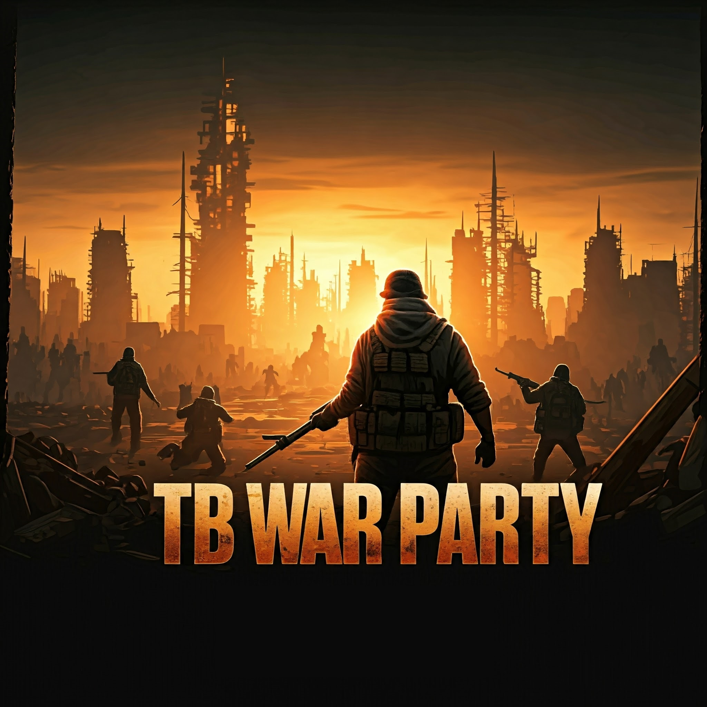

# TB War Party

## Features

Full list of features can be found at [Shop](https://www.themodbase.com/mods/TBWarParty)

## Shop Link

https://www.themodbase.com/mods/TBWarParty

## Support

If you need any support, please open a ticket here: https://discord.gg/kGjN6gJy3m

## Youtube

https://youtu.be/KUnfQ191dW4

## Tools

### Arena Mover

- Move an arena (`.dze` or ArenaBuildingConfig together with its spawn points) to another position: [Readme.md](Tools/ArenaMover/Readme.md)

### Arena Building Converter

- `.c` file to WarParty format converter: [Readme.md](Tools/Converter/CConverter/Readme.md)
- `.json` file to WarParty format converter: [Readme.md](Tools/Converter/JSONConverter/Readme.md)

## How to install

See also [here](../The%20Mod%20Base/README.md)

- Take the Server PBO and add it to your own server-side pack.
- Take the Client PBO and the TBLib PBO and add them to your own client pack. Publish this pack on Steam.
- Start the server for the first time and wait for it to fully boot.
- Shut down the server.
- Config files are created in `YourServerProfilesFolder\TBMods\Config\TBWarParty`.
- Configure your needs.
- Start your server again :-)

## Bots (optional)

Match creators can add bots to teams, create pure bot teams or fill free slots with bots. Bots are provided by **DayZ Expansion AI** through the **TBWarParty AI Extension**.

- Install DayZ Expansion AI (with its dependencies) on server and client.
- Add the `TBWarpartyAIExtensionClient` PBO to your client pack.
- Add the `TBWarpartyAIExtensionServer` PBO to your server-side pack.
- Configure the bots in `BotConfig.json`, see [BotConfig.md](Configs/BotConfig.md).
