# How to Set Up a Server

## License Setup

1. Open your Server Profiles folder and create a new folder with the name `TheModBase`

  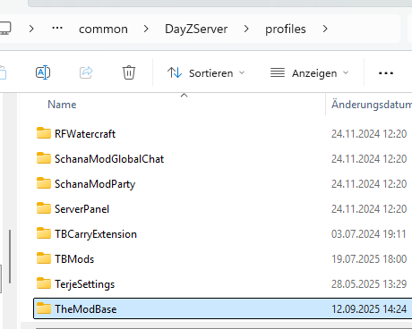

2. Create a new folder inside that folder with the name `Licenses`

  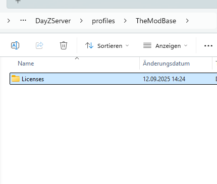

3. Move your [downloaded](Download.md) license(s) into that folder 

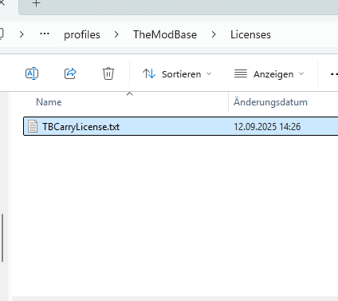

## Server-Side Mod Setup

1. Navigate to your downloads folder and extract the downloaded server ZIP file

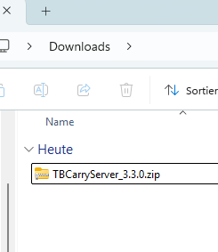
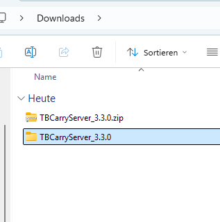

2. Enter the extracted folder

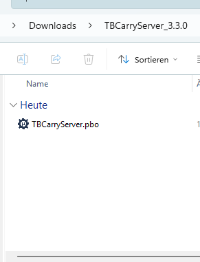

3. Move the PBO file into your DayZ server addons folder

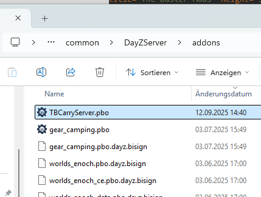

## Client-Side Mod Setup

1. Navigate to your downloads folder and extract the downloaded client ZIP file

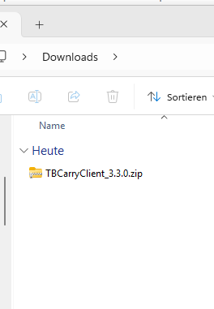
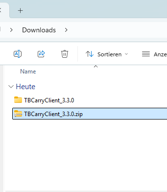

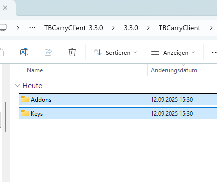

3. Enter the `Keys` folder and copy the `bikey` file into your server `Keys` folder

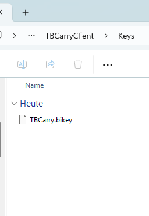
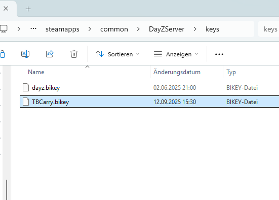

5. Enter the `Addons` folder and copy the `pbo` and `bisign` files into your workshop mod folder

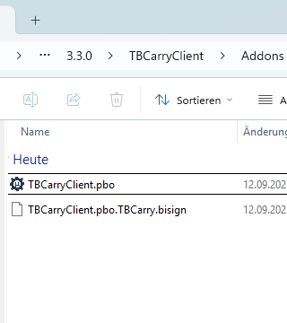
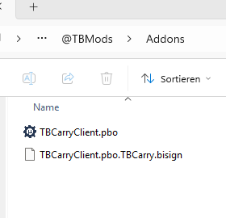

6. Publish your workshop mod (see [PublishAServerModPackage.md](PublishAServerModPackage.md))
7. Add the workshop mod to your server

## Important Notes

- Make sure all file paths are correct
- Test your server before going live
- Keep backups of your original files
- Check server logs for any errors after installation