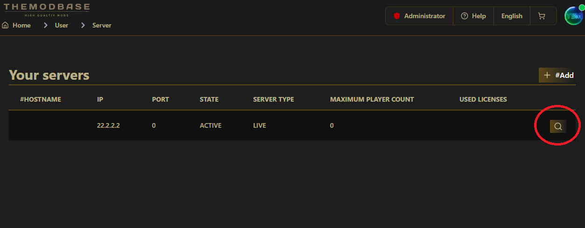
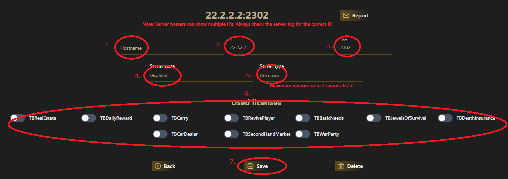

# How to config @ TheModBase.com

- Follow [Download.md](Download.md)
- and [PublishAServerModPackage.md](PublishAServerModPackage.md)
- and [AddToServer.md](AddToServer.md)

::: tip

After you have setup your Server like the Guides on Top explain you have you License Files at your Server Profiles Folder. 
If you have not done this so far, pls read the listed guides before

:::

1. Start your DayZ Server.

*The Server will now send a request to license server, the license server will create the server in your profiel. But the server is still not usable you need to activate the server.*

2. Open https://www.themodbase.com/user/server

*Here you can find alle your manual and auto created servers.*

3. Click on the glass to see the details of the auto created server

4. Steps on Details overview

   1. Enter your server name (optional)
   2. Check/Change your IP. If your Server is auto generated by our Licensecheck you don´t need to change it
   3. Check/Change your Port. If your Server is auto generated by our Licensecheck you don´t need to change it
   4. set your Server State to active
   5. set your Server to Test or Live Server. Test Servers count not into your Licenses. It is not allowed to have more than 5 Players on your Testserver.
   6. Select the mods you want to use on your Server
   7. Save your Server config
  