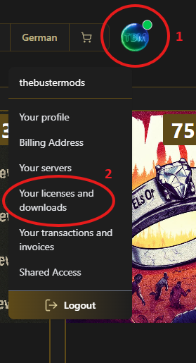
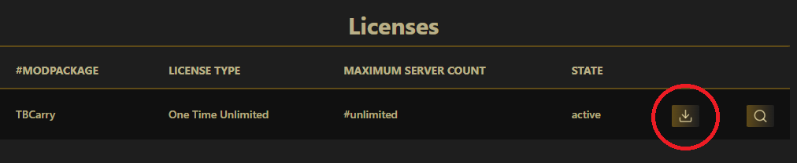
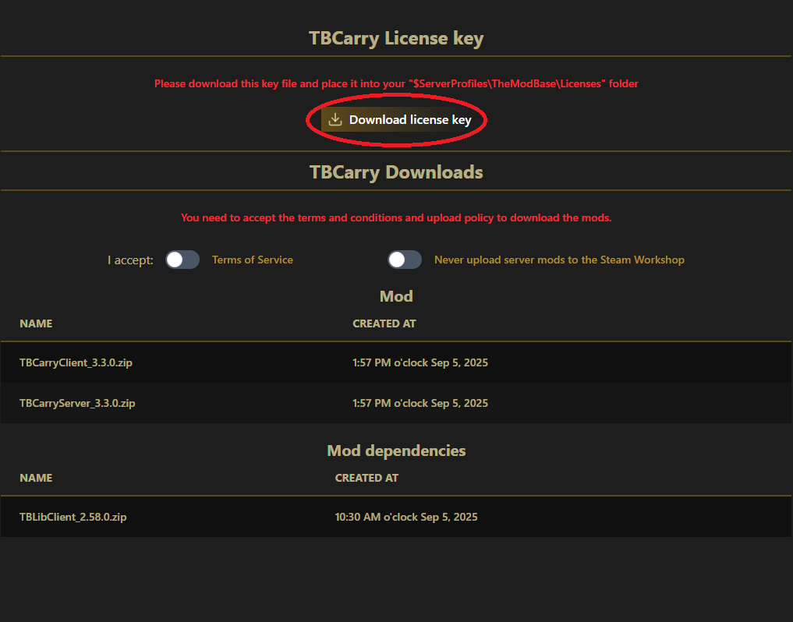
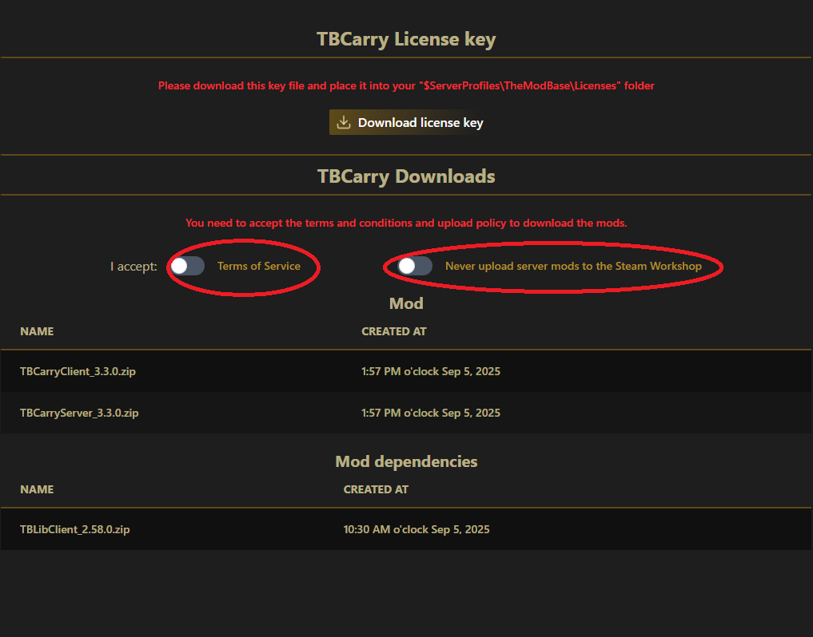
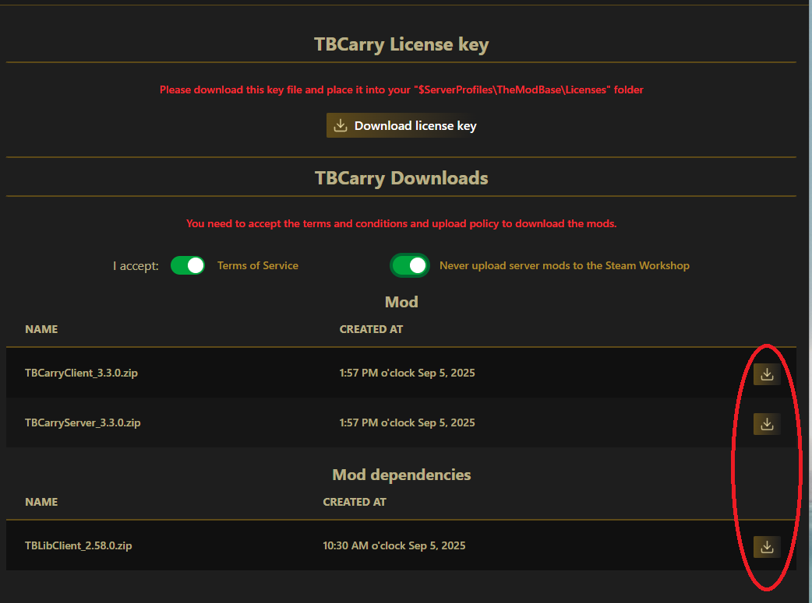

# How to Download the Mod Base Mods

1. Open the webshop at https://themodbase.com and login
2. Navigate to "Your license and downloads"

  

3. Click on the download icon

  

4. Download your License Key for later use

  

5. Accept Terms & Conditions and Upload Policy

  

6. Download the Mods and Dependencies

  

## Next Steps

After downloading your mods and license:
- [Set up your server](AddToServer.md) with the downloaded files
- [Publish your mod package](PublishAServerModPackage.md) to Steam Workshop
