# How to Setup a Server

## License Setup

1. Open your Server Profiles Folder and create a new Folder with name `TheModBase`.

  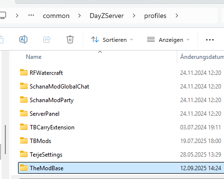

2. create in that Folder a new Folder with name `Licenses`

  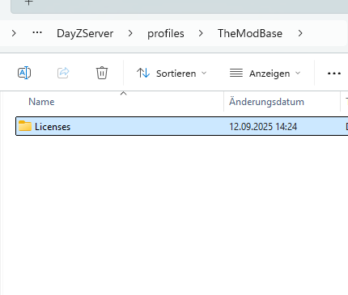

3. Move your [downloaded](Download.md) License(s) into that Folder 

  

## Server Side Mod Setup

1. Enter your downloads folder and extract the downloaded Server Zip

  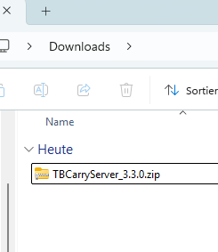
  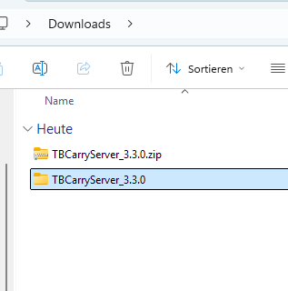

2. Enter the extracted Folder

  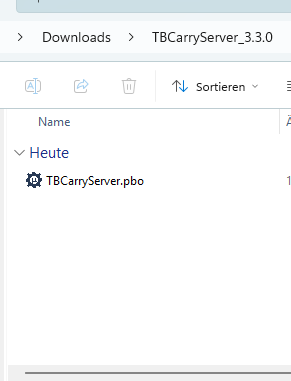

3. Move the pbo file into your DayZ Server Addons Folder

  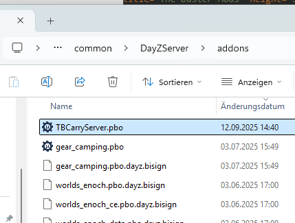

## Client Side Mod Setup

1. Enter your downloads folder and extract the downloaded Client Zip.

  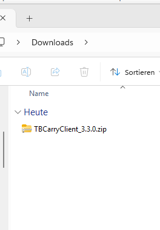
  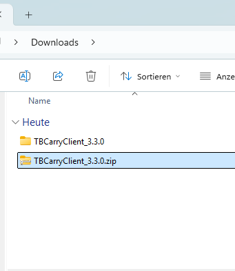

2. Enter the extracted Zip Folder so that you can see `Addons` and `Keys` folder

  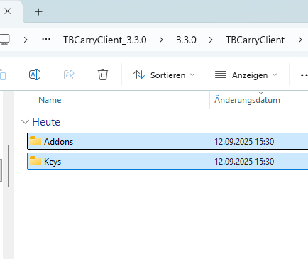

3. Enter the `Keys` and copy the `bikey` file into your server `Keys` Folder

  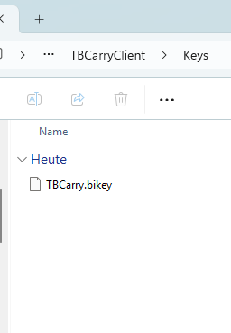
  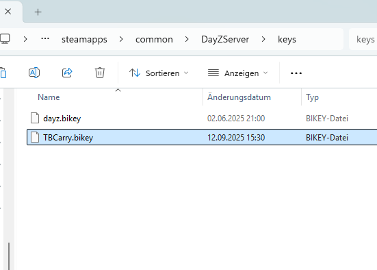

4. Go back to Folder where you can see `Addons` and `Keys` folder

  

5. Enter the `Addons` Folder and copy the `pbo` and the `bisign` file into your Workshop Mod.

  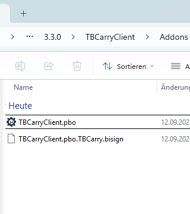
  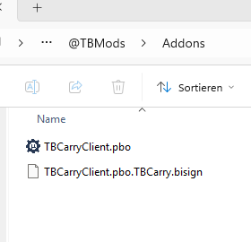

6. Publish your Workshop Mod
7. Add the Workshop Mod to your Server