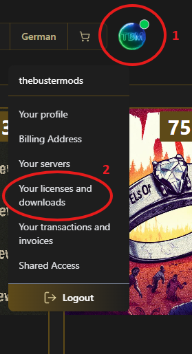
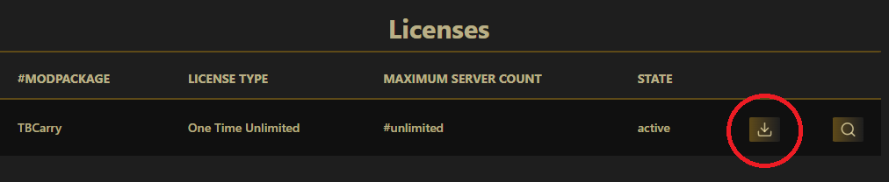
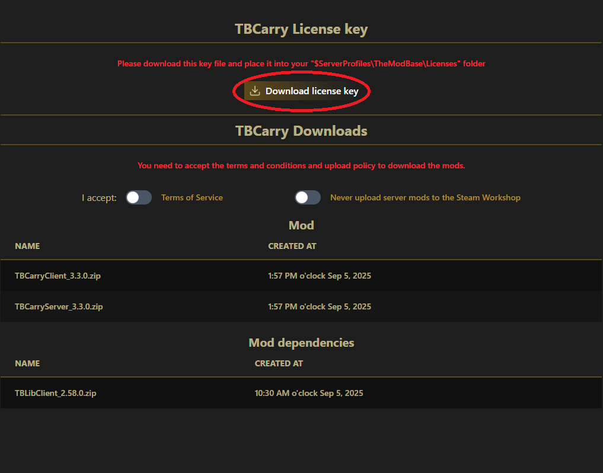
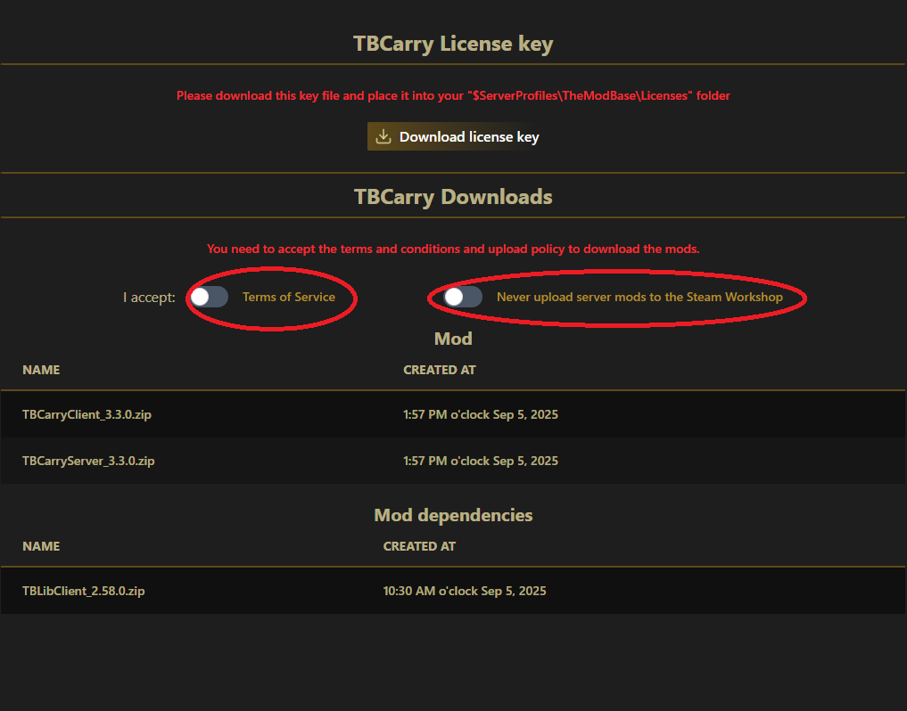
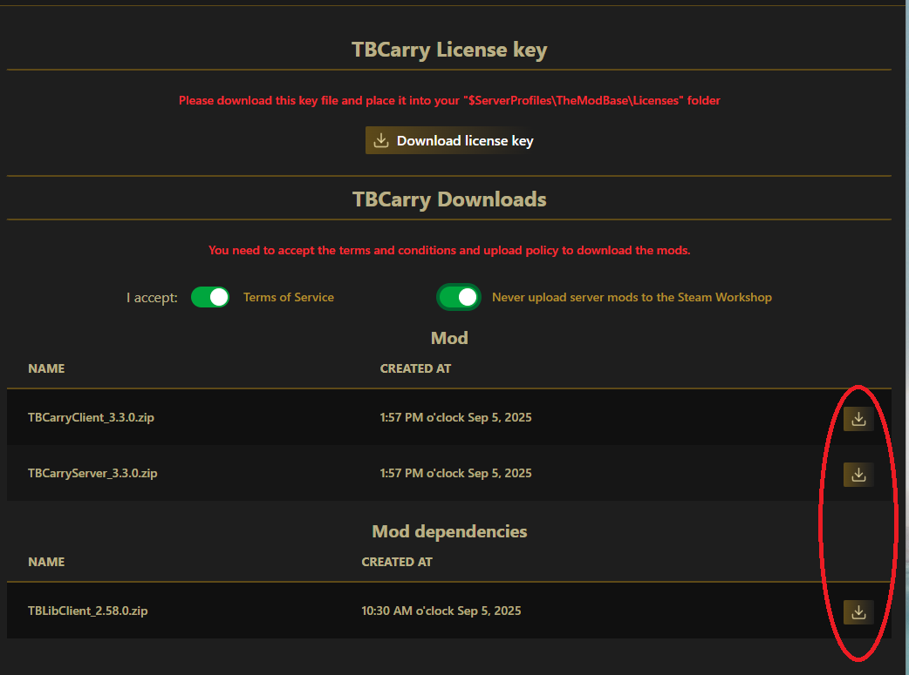

# How to Download the Modbase Mods

1. Open the Webshop `https://themodbase.com`
2. Navigate to `Your license and downloads`

  

3. click on download icon

  

4. Download your License Key for later

  

5. Accept Terms & Conditions and Upload Policy

  

6. Download the Mods and the Dependencies

  

