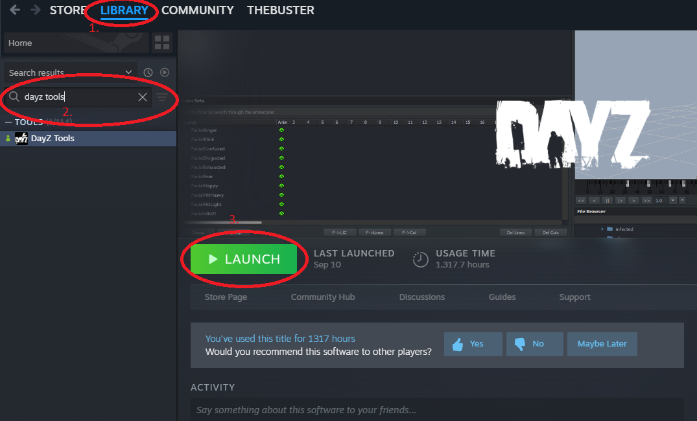
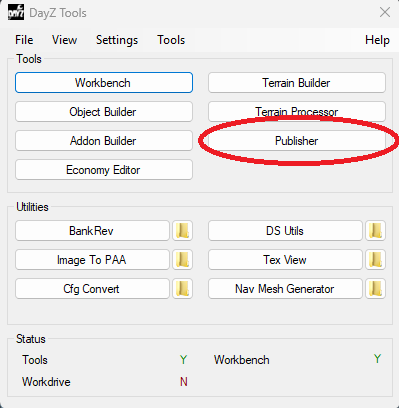
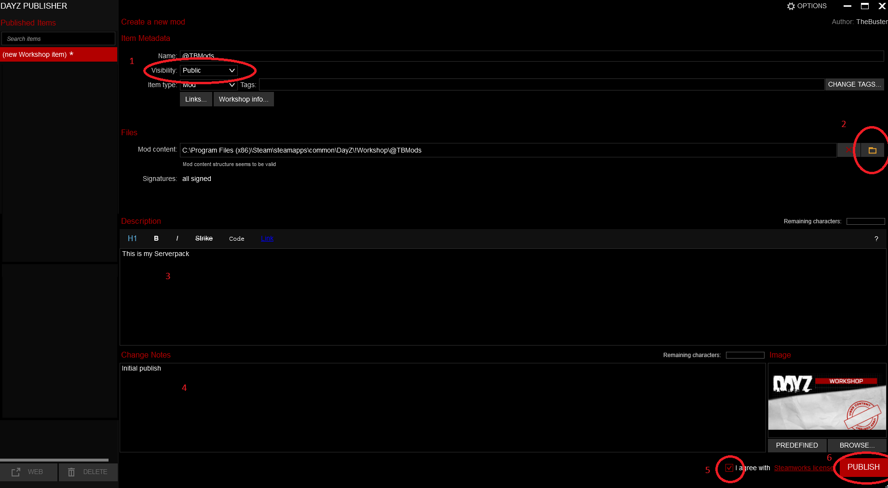

# How to Publish a Server Mod Pack at Steam Workshop

1. Open Steam and search in your library for `DayZ Tools`. Install and start DayZ Tools

2. Start `Publisher` in DayZ Tools

3. In the publisher:
- Click on "New Workshop Item"
- **Step 1**: Set visibility to `Public`
- **Step 2**: Select the folder where you have created your server pack (see [AddToServer.md#client-side-mod-setup](AddToServer.md#client-side-mod-setup))
- **Step 3**: Add your description (optional)
- **Step 4**: Add your changelog
- **Step 5**: Agree with `Steamworks` license
- **Step 6**: Press `PUBLISH`

**Important**: When you publish the mod for the first time, you need to update the mod after publishing again. Otherwise, nobody can use the mod.

## After Publishing

1. **Update the mod** - This is crucial for first-time publishing
2. **Test the mod** - Make sure it works correctly
3. **Add to your server** - Configure your server to use the published mod
4. **Monitor for issues** - Check server logs and player feedback

## Troubleshooting

- If the mod doesn't appear, wait a few minutes and refresh
- Check that all files are properly included in the workshop item
- Verify that the mod is set to public visibility
- Ensure all dependencies are included
