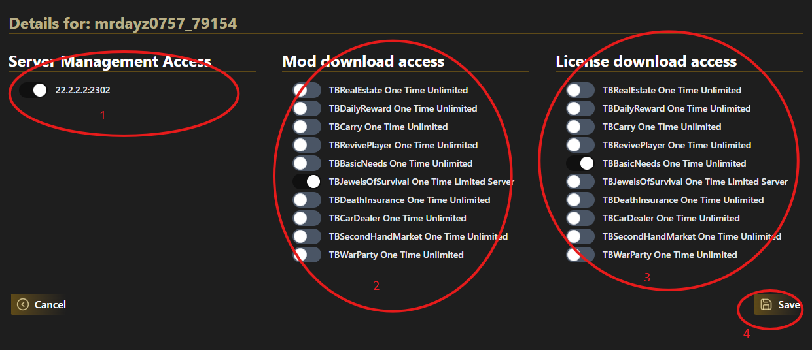

# How to Share Access to Licenses or/and Servers

## First Part for owner of mod and server.

1. Open https://www.themodbase.com/user/shared-access
2. Click on create Invitation

3. Enter the Discord ID (NOT the name) from the User you want to share your mods or/and server.

4. click on save button
5. on Button `1` you can delete the invitation. On Button `2` you can copy the invitation link and share it to the user. The user will with the Link direct forwarded to step 7 

## First Part for invited User

6. Open `https://www.themodbase.com/user/shared-access` and click on glasses button

7. To accept the invitation click on `Save` Button

## Second Part for owner of mod and server

8. After the invited user (step 6 and 7) has accepted the invitation the owner can give access rights. Click on glas to open details.

9.
   1. enable servers you want to share. The invited user will be able to manage this server
   2. enable the mods you want to share. The invited user will be able to download the mod
   3. click on `save` button

## Second Part for invited user
10. after your access rights where configured in step 9 you can open the details of your invitations

11. You are now able to download mods or/and manage the servers
